# GSM 통신 완벽 가이드

## 목차

1. [개요](#1-개요)
2. [하드웨어 구성](#2-하드웨어-구성)
3. [소프트웨어 아키텍처](#3-소프트웨어-아키텍처)
4. [AT 명령어 처리 메커니즘](#4-at-명령어-처리-메커니즘)
5. [TCP/IP 통신](#5-tcpip-통신)
6. [LTE 초기화 시퀀스](#6-lte-초기화-시퀀스)
7. [DMA 순환 버퍼](#7-dma-순환-버퍼)
8. [주요 API 함수](#8-주요-api-함수)
9. [에러 처리 및 재시도](#9-에러-처리-및-재시도)
10. [디버깅 가이드](#10-디버깅-가이드)

---

## 1. 개요

이 프로젝트는 **STM32F405RG 마이크로컨트롤러**와 **Quectel EC25 LTE 모듈**을 사용하여 GSM/LTE 통신을 구현합니다.

### 주요 특징

- **FreeRTOS 기반 멀티태스킹**: Producer-Consumer 패턴으로 AT 명령 비동기 처리
- **DMA 순환 버퍼**: 제로 카피로 UART 데이터 고속 수신
- **TCP/IP 스택**: 최대 12개의 동시 TCP 소켓 지원 (EC25 하드웨어 제한)
- **자동 재시도 메커니즘**: 네트워크 장애 시 자동 복구
- **lwcell 방식 설계**: 경량화된 셀룰러 통신 라이브러리 패턴 적용

### 통신 사양

| 항목 | 사양 |
|------|------|
| 모듈 | Quectel EC25 LTE Cat 4 |
| UART 속도 | 115200 bps |
| 인터페이스 | USART1 (PA9/PA10) |
| DMA | DMA2 Stream2 (RX 전용) |
| 버퍼 크기 | 2048 bytes (순환 버퍼) |
| 지원 네트워크 | LTE FDD/TDD, WCDMA, GSM |
| 최대 다운로드 | 150 Mbps |
| 최대 업로드 | 50 Mbps |

---

## 2. 하드웨어 구성

### 2.1 EC25 LTE 모듈 핀 연결

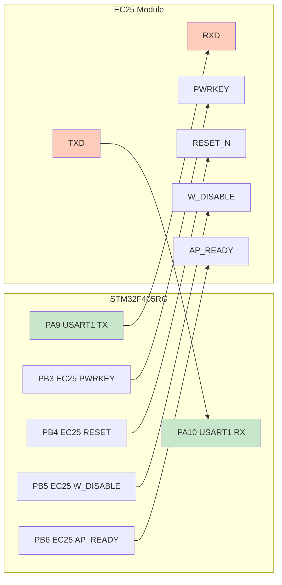

### 2.2 전원 제어 시퀀스

EC25 모듈 전원 ON 시퀀스:

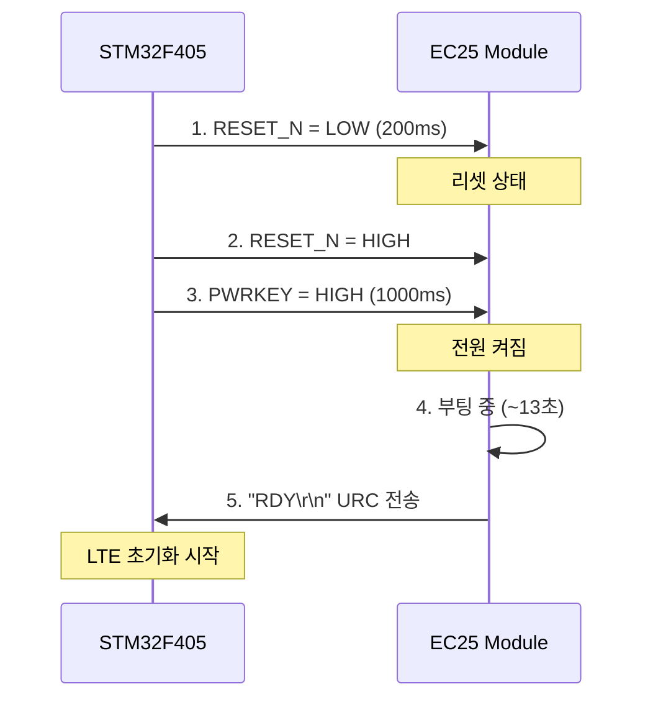

### 2.3 DMA 구성

```c
// DMA2 Stream2 Channel 4 (USART1 RX)
DMA_HandleTypeDef hdma_usart1_rx;

hdma_usart1_rx.Instance = DMA2_Stream2;
hdma_usart1_rx.Init.Channel = DMA_CHANNEL_4;
hdma_usart1_rx.Init.Direction = DMA_PERIPH_TO_MEMORY;
hdma_usart1_rx.Init.PeriphInc = DMA_PINC_DISABLE;
hdma_usart1_rx.Init.MemInc = DMA_MINC_ENABLE;
hdma_usart1_rx.Init.PeriphDataAlignment = DMA_PDATAALIGN_BYTE;
hdma_usart1_rx.Init.MemDataAlignment = DMA_MDATAALIGN_BYTE;
hdma_usart1_rx.Init.Mode = DMA_CIRCULAR;  // ★ 순환 모드
hdma_usart1_rx.Init.Priority = DMA_PRIORITY_HIGH;
```

---

## 3. 소프트웨어 아키텍처

### 3.1 전체 레이어 구조

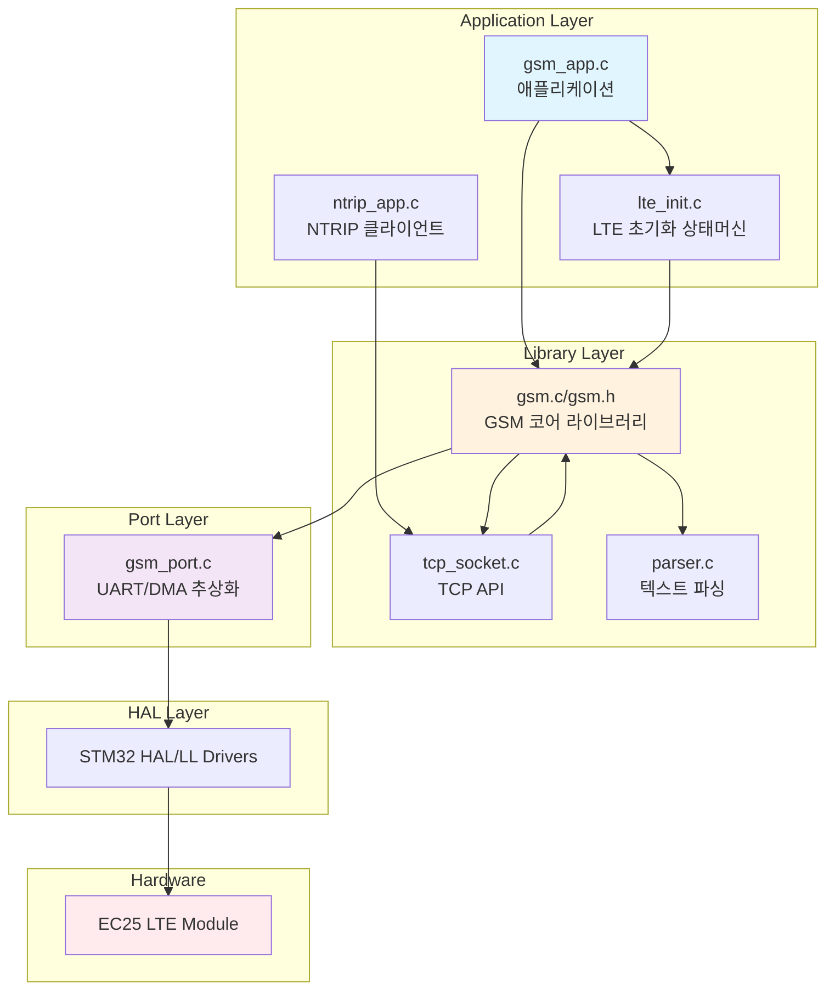

### 3.2 FreeRTOS 태스크 구조

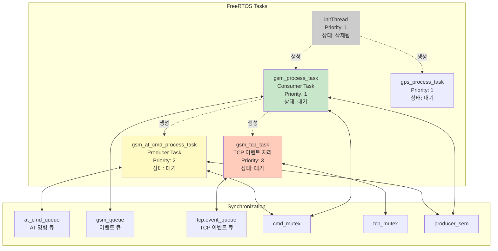

---

## 4. AT 명령어 처리 메커니즘

### 4.1 Producer-Consumer 패턴

이 시스템은 **lwcell** 라이브러리의 설계를 따릅니다.

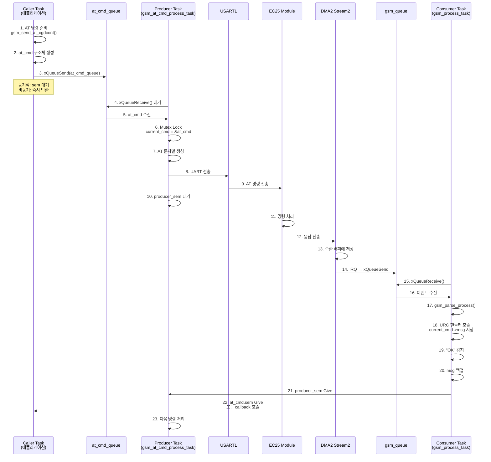

### 4.2 AT 명령 상태 다이어그램

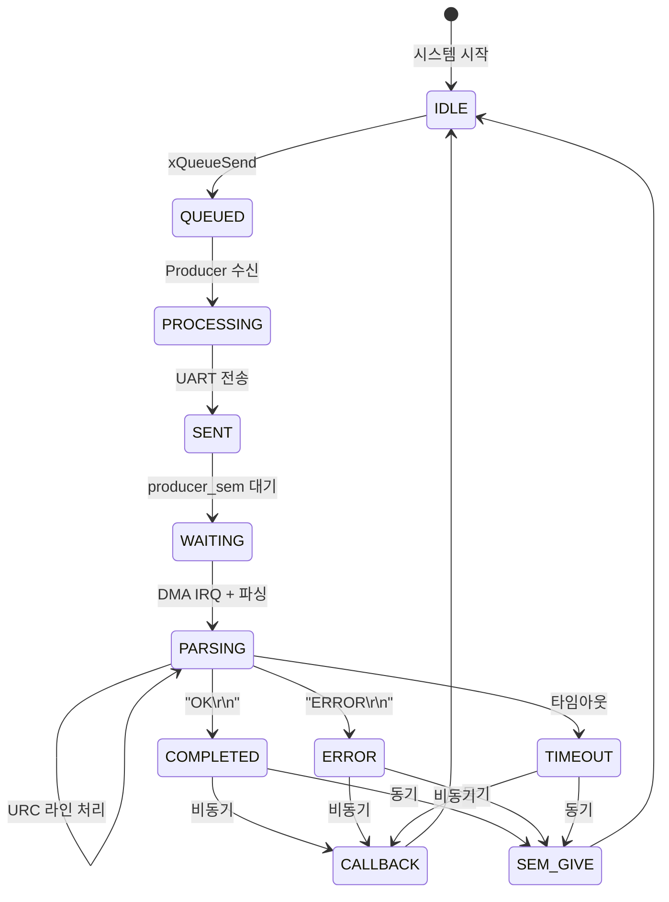

### 4.3 주요 AT 명령어 테이블

| 명령어 | 설명 | 타임아웃 | 응답 예제 |
|--------|------|----------|----------|
| `AT` | 통신 테스트 | 300ms | `OK\r\n` |
| `ATE0` | 에코 비활성화 | 300ms | `OK\r\n` |
| `AT+CMEE=2` | 에러 모드 설정 | 300ms | `OK\r\n` |
| `AT+CPIN?` | SIM 상태 확인 | 5000ms | `+CPIN: READY\r\nOK\r\n` |
| `AT+CGDCONT=1,"IP","internet"` | APN 설정 | 300ms | `OK\r\n` |
| `AT+CGDCONT?` | APN 조회 | 300ms | `+CGDCONT: 1,"IP","internet"\r\nOK\r\n` |
| `AT+COPS?` | 네트워크 조회 | 180000ms | `+COPS: 0,0,"SKT",7\r\nOK\r\n` |
| `AT+QIOPEN=1,0,"TCP","192.168.1.1",8080` | TCP 연결 | 150000ms | `OK\r\n+QIOPEN: 0,0\r\n` |
| `AT+QISEND=0,100` | TCP 전송 | 5000ms | `> ` (프롬프트) |
| `AT+QIRD=0,1460` | TCP 수신 | 5000ms | `+QIRD: 512\r\n[바이너리 데이터]\r\nOK\r\n` |
| `AT+QICLOSE=0` | TCP 종료 | 10000ms | `OK\r\n+QICLOSE: 0\r\n` |

### 4.4 URC (Unsolicited Result Code) 핸들러

```c
// URC 핸들러 테이블 (gsm.c)
const urc_handler_entry_t urc_info_handlers[] = {
    {"+CMEE: ", handle_urc_cmee},       // 에러 코드
    {"+CGDCONT: ", handle_urc_cgdcont}, // APN 정보
    {"+CPIN: ", handle_urc_cpin},       // SIM 상태
    {"+COPS: ", handle_urc_cops},       // 네트워크 정보
    {"+QIOPEN: ", handle_urc_qiopen},   // TCP 연결 결과
    {"+QICLOSE: ", handle_urc_qiclose}, // TCP 종료 결과
    {"+QISEND: ", handle_urc_qisend},   // TCP 전송 결과
    {"+QIRD: ", handle_urc_qird},       // TCP 수신 데이터
    {"+QIURC: ", handle_urc_qiurc},     // TCP 이벤트 알림
    {NULL, NULL}
};

const urc_handler_entry_t urc_status_handlers[] = {
    {"RDY", handle_urc_rdy},                     // 모듈 준비
    {"POWERED DOWN", handle_urc_powered_down},   // 모듈 종료
    {NULL, NULL}
};
```

---

## 5. TCP/IP 통신

### 5.1 TCP 연결 플로우

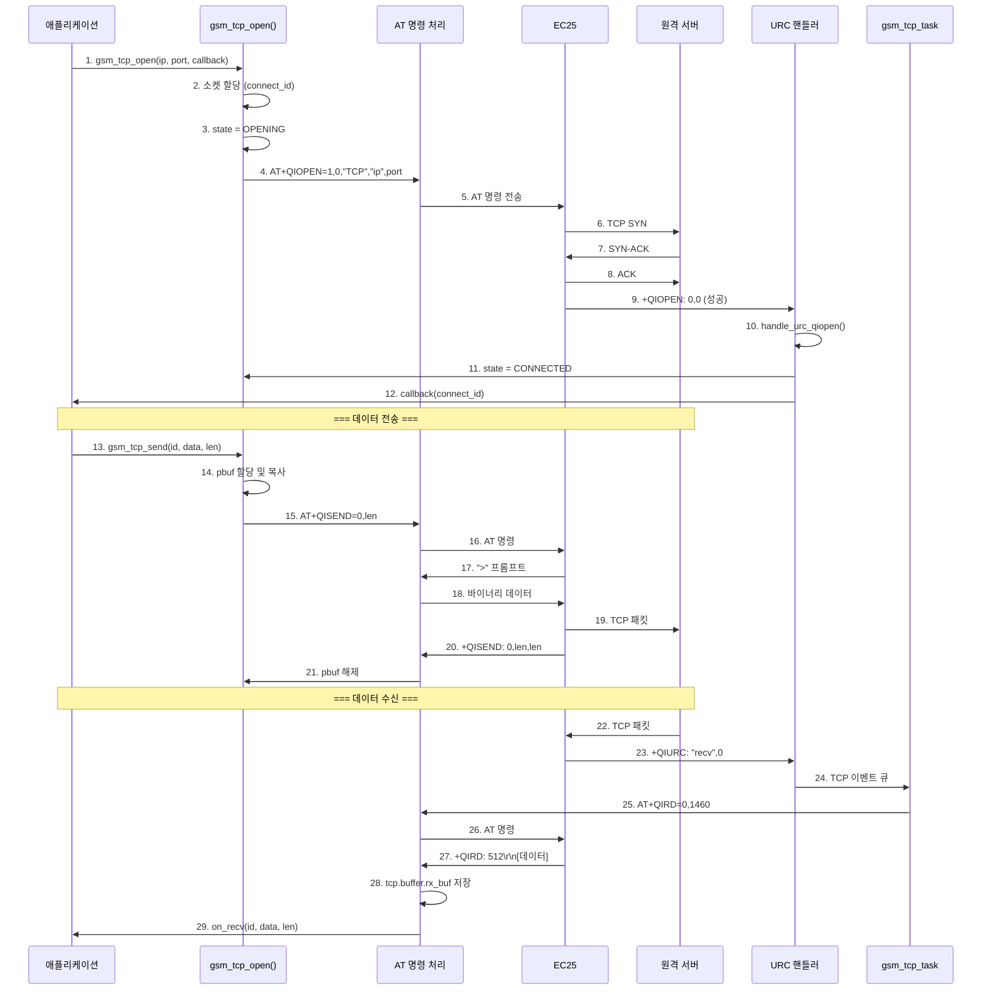

### 5.2 TCP 소켓 상태 머신

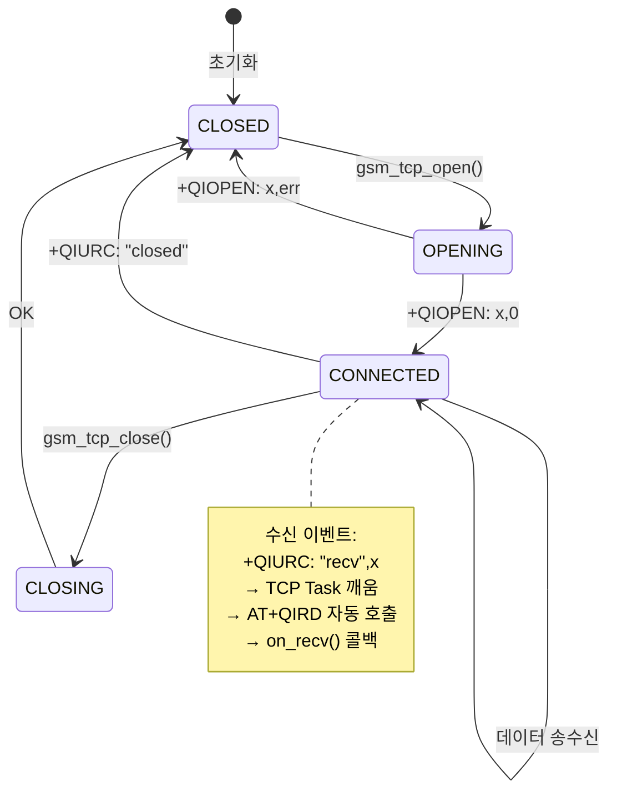

### 5.3 pbuf (Packet Buffer) 관리

lwcell 방식의 pbuf 체인을 사용합니다.

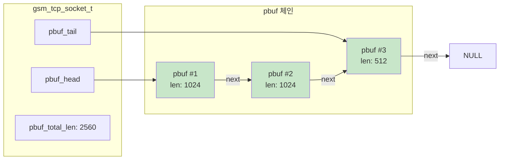

**pbuf 구조체**:

```c
typedef struct tcp_pbuf_s {
    uint8_t *payload;           // 데이터 포인터 (malloc)
    size_t len;                 // 현재 pbuf 길이
    size_t tot_len;             // 전체 체인 길이
    struct tcp_pbuf_s *next;    // 다음 pbuf
} tcp_pbuf_t;
```

**pbuf 함수**:

- `tcp_pbuf_alloc(len)`: pbuf 할당
- `tcp_pbuf_free(pbuf)`: pbuf 해제 (재귀적)
- `tcp_pbuf_enqueue(socket, pbuf)`: 소켓 큐에 추가
- `tcp_pbuf_dequeue(socket)`: 소켓 큐에서 꺼내기

---

## 6. LTE 초기화 시퀀스

### 6.1 초기화 상태 머신

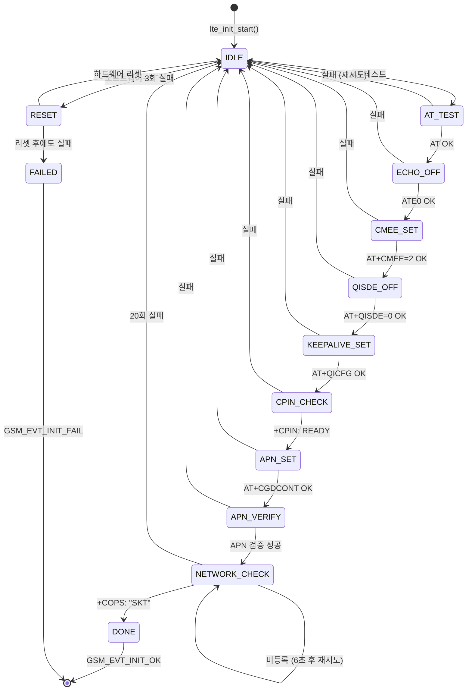

### 6.2 초기화 시퀀스 다이어그램

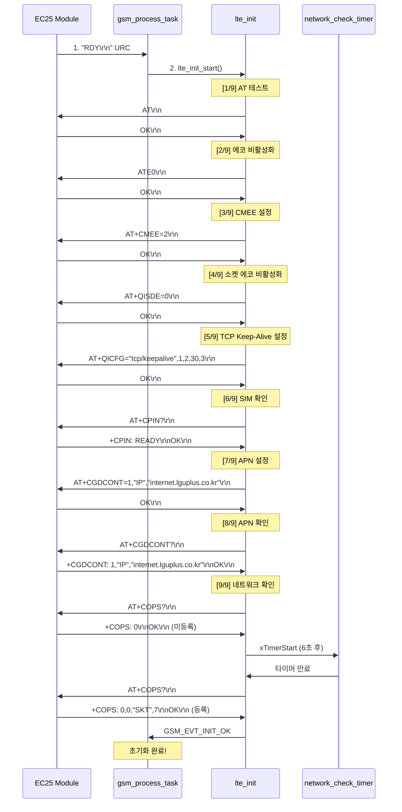

### 6.3 재시도 메커니즘

```mermaid
graph TD
    START[초기화 시작] --> ATTEMPT{시도 횟수?}

    ATTEMPT -->|1~3회| SW_RETRY[소프트웨어 재시도]
    ATTEMPT -->|4회| HW_RESET[하드웨어 리셋]
    ATTEMPT -->|5회| FAIL[초기화 실패]

    SW_RETRY --> WAIT1[1초 대기]
    WAIT1 --> RESTART1[lte_init_start()]
    RESTART1 --> ATTEMPT

    HW_RESET --> RESET[EC25 모듈 리셋]
    RESET --> WAIT2[RDY 대기 (~13초)]
    WAIT2 --> RESTART2[lte_init_start()]
    RESTART2 --> ATTEMPT

    FAIL --> EVENT[GSM_EVT_INIT_FAIL]

    style SW_RETRY fill:#fff9c4
    style HW_RESET fill:#ffccbc
    style FAIL fill:#ffcdd2
```

---

## 7. DMA 순환 버퍼

### 7.1 DMA 순환 버퍼 동작 원리

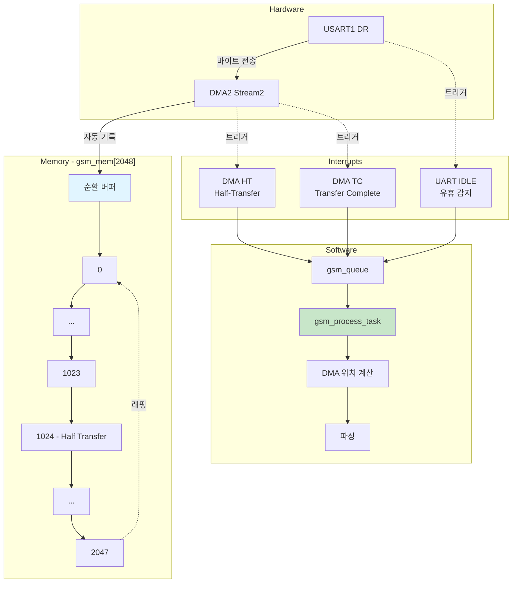

### 7.2 버퍼 파싱 로직

```c
void gsm_process_task(void *pvParameter) {
    size_t pos = 0;
    size_t old_pos = 0;

    while (1) {
        xQueueReceive(gsm_queue, &dummy, portMAX_DELAY);

        // 현재 DMA 위치 계산
        pos = gsm_get_rx_pos();  // 2048 - DMA_GetDataLength()

        if (pos != old_pos) {
            if (pos > old_pos) {
                // 선형 파싱
                gsm_parse_process(&gsm_handle, &gsm_mem[old_pos], pos - old_pos);
            } else {
                // 래핑 파싱 (2단계)
                // 1. old_pos ~ 2047
                gsm_parse_process(&gsm_handle, &gsm_mem[old_pos],
                                  sizeof(gsm_mem) - old_pos);
                // 2. 0 ~ pos
                if (pos > 0) {
                    gsm_parse_process(&gsm_handle, gsm_mem, pos);
                }
            }
            old_pos = pos;
        }
    }
}
```

### 7.3 파싱 예제

```
수신 데이터: "AT\r\n+CPIN: READY\r\nOK\r\n"

[단계 1] DMA가 바이트 단위로 수신
gsm_mem[0] = 'A'
gsm_mem[1] = 'T'
gsm_mem[2] = '\r'
gsm_mem[3] = '\n'
...
gsm_mem[23] = '\n'

[단계 2] UART IDLE 인터럽트
pos = 24

[단계 3] gsm_parse_process()
라인 1: "AT" → 무시 (요청 에코)
라인 2: "+CPIN: READY" → handle_urc_cpin()
        → current_cmd->msg.cpin.code = "READY"
라인 3: "OK" → is_ok = 1
        → producer_sem Give
```

---

## 8. 주요 API 함수

### 8.1 AT 명령 전송 API

#### 8.1.1 범용 AT 명령

```c
/**
 * @brief AT 명령 전송 (범용)
 *
 * @param gsm GSM 핸들
 * @param cmd 명령어 타입 (GSM_CMD_AT, GSM_CMD_CGDCONT 등)
 * @param at_mode 명령어 모드 (EXECUTE, READ, WRITE, TEST)
 * @param params 파라미터 문자열 (NULL 가능)
 * @param callback 완료 콜백 (NULL이면 동기식)
 */
void gsm_send_at_cmd(gsm_t *gsm, gsm_cmd_t cmd, gsm_at_mode_t at_mode,
                     const char *params, at_cmd_handler callback);

// 사용 예제 (동기식)
gsm_send_at_cmd(&gsm_handle, GSM_CMD_AT, GSM_AT_EXECUTE, NULL, NULL);
if (gsm_handle.status.is_ok) {
    // 성공
}

// 사용 예제 (비동기식)
void my_callback(gsm_t *gsm, gsm_cmd_t cmd, void *msg, bool is_ok) {
    if (is_ok) {
        LOG_INFO("AT 명령 성공");
    }
}
gsm_send_at_cmd(&gsm_handle, GSM_CMD_AT, GSM_AT_EXECUTE, NULL, my_callback);
```

#### 8.1.2 APN 설정

```c
/**
 * @brief APN 설정/조회
 *
 * @param gsm GSM 핸들
 * @param at_mode READ (조회) 또는 WRITE (설정)
 * @param ctx PDP context (WRITE 모드일 때만 필요)
 * @param callback 완료 콜백 (NULL이면 동기식)
 */
void gsm_send_at_cgdcont(gsm_t *gsm, gsm_at_mode_t at_mode,
                         gsm_pdp_context_t *ctx, at_cmd_handler callback);

// 사용 예제 (APN 설정)
gsm_pdp_context_t ctx = {
    .cid = 1,
    .type = GSM_PDP_TYPE_IP,
    .apn = "internet.lguplus.co.kr"
};
gsm_send_at_cgdcont(&gsm_handle, GSM_AT_WRITE, &ctx, NULL);

// 사용 예제 (APN 조회)
void apn_callback(gsm_t *gsm, gsm_cmd_t cmd, void *msg, bool is_ok) {
    if (is_ok) {
        gsm_msg_t *m = (gsm_msg_t *)msg;
        for (size_t i = 0; i < m->cgdcont.count; i++) {
            LOG_INFO("CID %d: %s",
                     m->cgdcont.contexts[i].cid,
                     m->cgdcont.contexts[i].apn);
        }
    }
}
gsm_send_at_cgdcont(&gsm_handle, GSM_AT_READ, NULL, apn_callback);
```

### 8.2 TCP/IP API

#### 8.2.1 TCP 연결

```c
/**
 * @brief TCP 소켓 오픈
 *
 * @param gsm GSM 핸들
 * @param connect_id 소켓 ID (0~11)
 * @param context_id PDP context ID (일반적으로 1)
 * @param remote_ip 원격 IP 주소
 * @param remote_port 원격 포트
 * @param local_port 로컬 포트 (0이면 자동 할당)
 * @param on_recv 데이터 수신 콜백
 * @param on_close 연결 종료 콜백
 * @param callback AT 명령 완료 콜백
 * @return int 0: 성공, -1: 실패
 */
int gsm_tcp_open(gsm_t *gsm, uint8_t connect_id, uint8_t context_id,
                 const char *remote_ip, uint16_t remote_port,
                 uint16_t local_port, tcp_recv_callback_t on_recv,
                 tcp_close_callback_t on_close, at_cmd_handler callback);

// 사용 예제
void tcp_recv_handler(uint8_t connect_id) {
    // TCP 데이터 수신 시 호출
    gsm_tcp_socket_t *socket = gsm_tcp_get_socket(&gsm_handle, connect_id);
    tcp_pbuf_t *pbuf = tcp_pbuf_dequeue(socket);
    if (pbuf) {
        // pbuf->payload에서 데이터 읽기
        process_data(pbuf->payload, pbuf->len);
        tcp_pbuf_free(pbuf);
    }
}

void tcp_close_handler(uint8_t connect_id) {
    LOG_WARN("TCP 연결 종료: %d", connect_id);
}

// TCP 연결
int ret = gsm_tcp_open(&gsm_handle, 0, 1,
                       "192.168.1.100", 8080, 0,
                       tcp_recv_handler, tcp_close_handler, NULL);
```

#### 8.2.2 TCP 전송

```c
/**
 * @brief TCP 데이터 전송
 *
 * @param gsm GSM 핸들
 * @param connect_id 소켓 ID
 * @param data 전송할 데이터
 * @param len 데이터 길이 (최대 1460 bytes)
 * @param callback AT 명령 완료 콜백
 * @return int 0: 성공, -1: 실패
 */
int gsm_tcp_send(gsm_t *gsm, uint8_t connect_id, const uint8_t *data,
                 size_t len, at_cmd_handler callback);

// 사용 예제
const char *http_request = "GET / HTTP/1.1\r\nHost: example.com\r\n\r\n";
int ret = gsm_tcp_send(&gsm_handle, 0,
                       (const uint8_t *)http_request,
                       strlen(http_request), NULL);
```

#### 8.2.3 TCP 종료

```c
/**
 * @brief TCP 소켓 닫기
 *
 * @param gsm GSM 핸들
 * @param connect_id 소켓 ID
 * @param callback AT 명령 완료 콜백
 * @return int 0: 성공, -1: 실패
 */
int gsm_tcp_close(gsm_t *gsm, uint8_t connect_id, at_cmd_handler callback);

// 사용 예제
int ret = gsm_tcp_close(&gsm_handle, 0, NULL);
```

---

## 9. 에러 처리 및 재시도

### 9.1 LTE 초기화 재시도

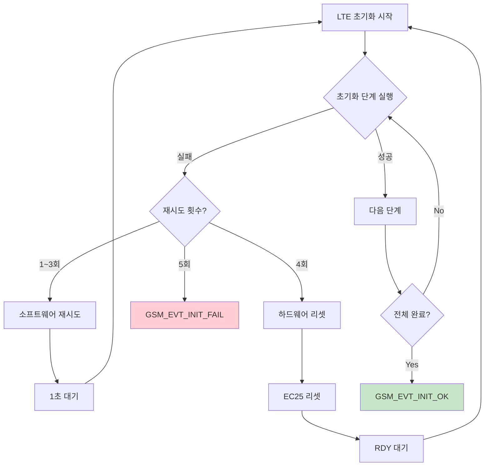

### 9.2 네트워크 등록 재시도

네트워크 등록은 최대 20회 (약 2분) 재시도합니다.

```c
#define LTE_NETWORK_CHECK_MAX_RETRY 20      // 최대 20회
#define LTE_NETWORK_CHECK_INTERVAL_MS 6000  // 6초 간격

// 타이머 콜백
void lte_network_check_timer_callback(TimerHandle_t xTimer) {
    gsm_send_at_cmd(gsm_handle_ptr, GSM_CMD_COPS, GSM_AT_READ, NULL,
                    lte_network_check_callback);
}
```

### 9.3 PDP Context 비활성화 처리

네트워크 문제로 PDP context가 비활성화되면 APN부터 재설정합니다.

```c
// +QIURC: "pdpdeact" URC 수신 시
case GSM_EVT_PDP_DEACT:
    lte_reinit_from_apn();  // APN 설정부터 재시작
    break;
```

---

## 10. 디버깅 가이드

### 10.1 로그 시스템

```c
#define TAG "GSM"
#include "log.h"

LOG_DEBUG("디버그 메시지");       // 녹색
LOG_INFO("정보 메시지");          // 흰색
LOG_WARN("경고 메시지");          // 노란색
LOG_ERR("에러 메시지");           // 빨간색
```

### 10.2 주요 디버깅 포인트

#### 10.2.1 AT 명령 타임아웃

```c
// gsm.c의 gsm_at_cmd_handlers 테이블 확인
{GSM_CMD_COPS, "AT+COPS", "+COPS: ", 180000},  // 3분
{GSM_CMD_QIOPEN, "AT+QIOPEN", "+QIOPEN: ", 150000},  // 2.5분
```

#### 10.2.2 DMA 버퍼 확인

```c
// 현재 DMA 위치
size_t pos = gsm_get_rx_pos();
LOG_DEBUG("DMA pos: %u", pos);

// 버퍼 내용 덤프
LOG_DEBUG_RAW("DMA", &gsm_mem[old_pos], len);
```

#### 10.2.3 TCP 소켓 상태

```c
gsm_tcp_socket_t *socket = gsm_tcp_get_socket(&gsm_handle, 0);
LOG_DEBUG("Socket state: %d, ip: %s, port: %d",
          socket->state, socket->remote_ip, socket->remote_port);
```

### 10.3 일반적인 문제 해결

| 문제 | 원인 | 해결 방법 |
|------|------|----------|
| LTE 초기화 실패 | SIM 카드 미삽입 | SIM 카드 확인 |
| 네트워크 등록 실패 | 신호 약함 | 안테나 확인 또는 위치 이동 |
| TCP 연결 실패 | APN 설정 오류 | `lte_init.c`에서 APN 확인 |
| TCP 데이터 수신 안 됨 | `+QIURC` URC 누락 | `handle_urc_qiurc()` 로그 확인 |
| AT 명령 타임아웃 | UART 통신 문제 | UART 연결 및 보레이트 확인 |
| DMA 버퍼 오버플로우 | 처리 속도 부족 | `gsm_process_task` 우선순위 상승 |

---

## 부록 A: 주요 데이터 구조

### gsm_t 구조체

```c
typedef struct gsm_s {
    gsm_recv_t recv;                  // 수신 버퍼
    gsm_status_t status;              // 상태 플래그
    gsm_evt_handler_t evt_handler;    // 이벤트 핸들러

    gsm_at_cmd_t *current_cmd;        // 현재 처리 중인 AT 명령
    SemaphoreHandle_t cmd_mutex;      // current_cmd 보호
    SemaphoreHandle_t producer_sem;   // Producer-Consumer 동기화
    QueueHandle_t at_cmd_queue;       // AT 명령 큐

    const gsm_hal_ops_t *ops;         // HAL 인터페이스
    const gsm_at_cmd_entry_t *at_tbl; // AT 명령 테이블

    gsm_tcp_t tcp;                    // TCP 관리
} gsm_t;
```

### gsm_tcp_socket_t 구조체

```c
typedef struct {
    uint8_t connect_id;               // 소켓 ID (0~11)
    gsm_tcp_state_t state;            // 연결 상태
    char remote_ip[64];               // 원격 IP
    uint16_t remote_port;             // 원격 포트
    uint16_t local_port;              // 로컬 포트

    tcp_pbuf_t *pbuf_head;            // 수신 버퍼 헤드
    tcp_pbuf_t *pbuf_tail;            // 수신 버퍼 테일
    size_t pbuf_total_len;            // 총 버퍼 길이

    tcp_recv_callback_t on_recv;      // 수신 콜백
    tcp_close_callback_t on_close;    // 종료 콜백
} gsm_tcp_socket_t;
```

---

## 부록 B: 추가 설명 가능한 주제

다음 주제들에 대해 더 자세히 설명이 필요하신가요?

1. **NTRIP 클라이언트 구현** (`ntrip_app.c`)
   - NTRIP 프로토콜 상세
   - RTCM 데이터 처리
   - 마운트포인트 연결

2. **멀티스레딩 최적화**
   - FreeRTOS 우선순위 조정
   - 데드락 방지 전략
   - 스택 크기 최적화

3. **전력 관리**
   - EC25 절전 모드
   - Wake-up 메커니즘

4. **실시간 모니터링**
   - 소켓 상태 모니터링 (`gsm_socket_monitor_start()`)
   - Keep-Alive 설정

5. **보안**
   - TLS/SSL 지원
   - 인증서 관리

---

## 참고 자료

- **EC25 AT 명령어 매뉴얼**: Quectel_EC2x&EG9x&EG2x-G&EM05_Series_AT_Commands_Manual
- **STM32F4 Reference Manual**: RM0090
- **FreeRTOS Documentation**: https://www.freertos.org/
- **lwcell Library**: https://github.com/MaJerle/lwcell

---

**문서 버전**: 1.0
**최종 수정일**: 2025-01-30
**작성자**: Claude Code Agent