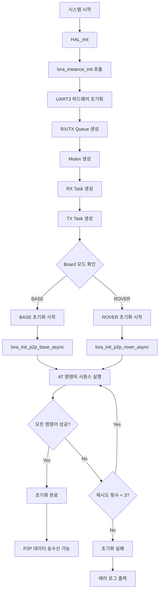
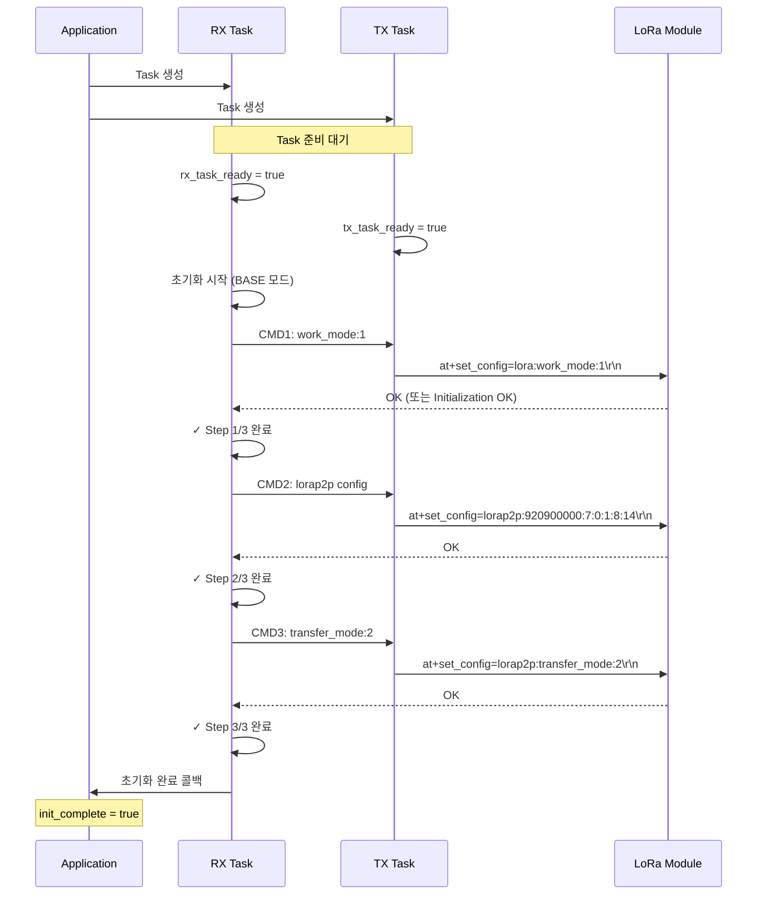
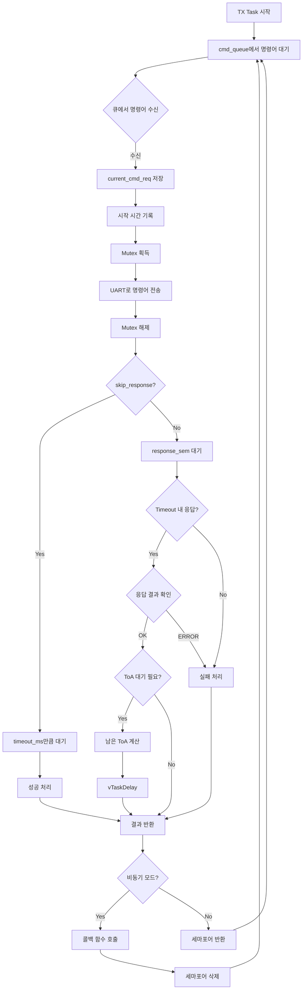
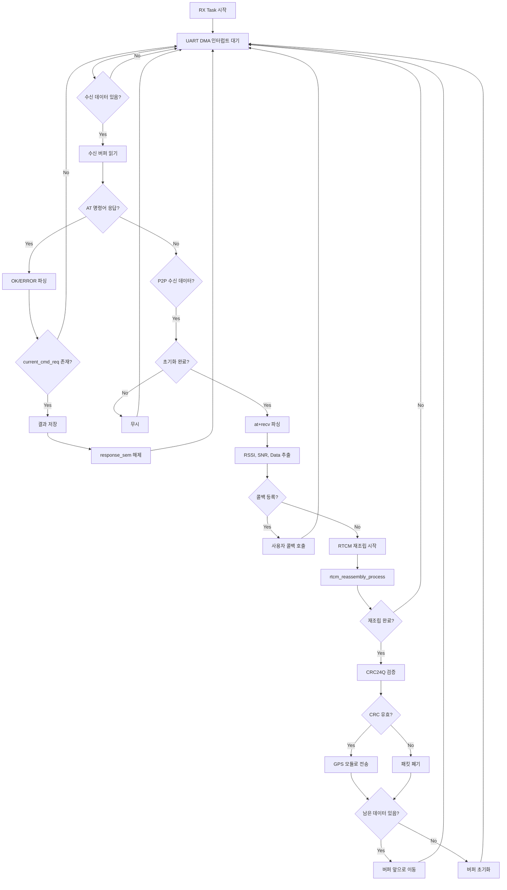
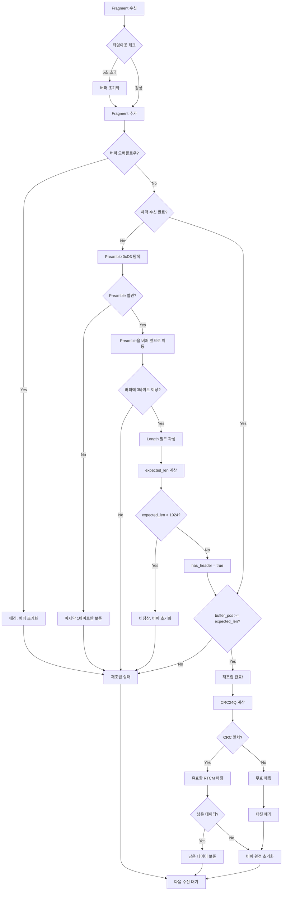
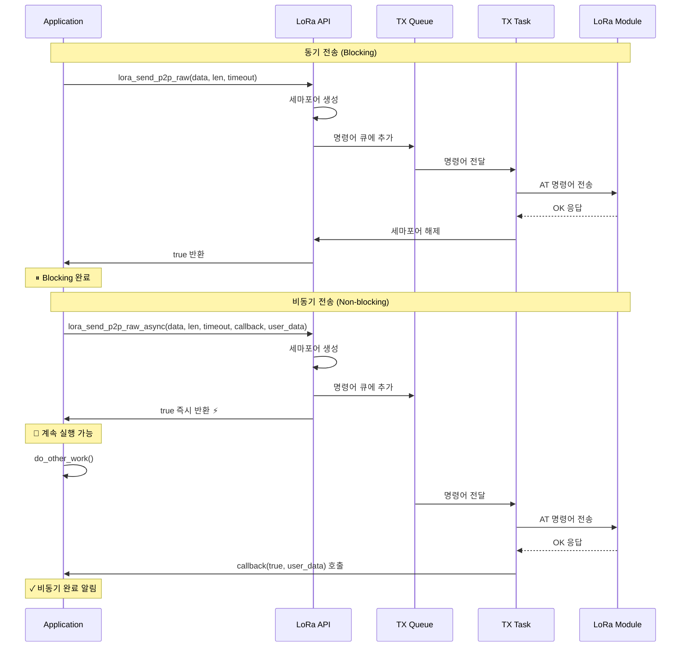
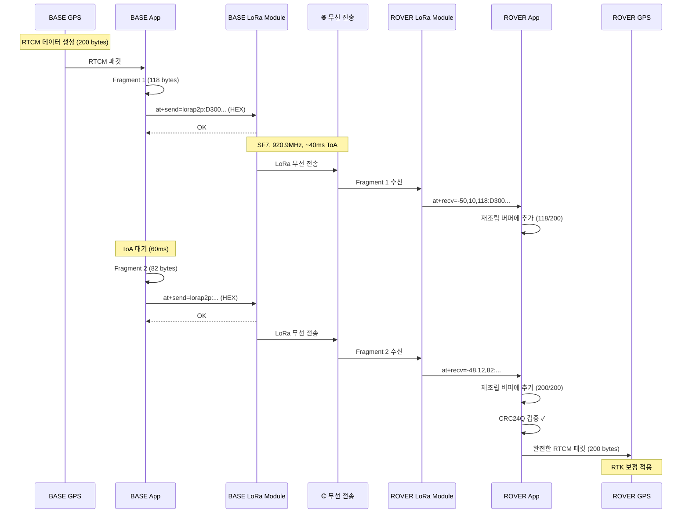
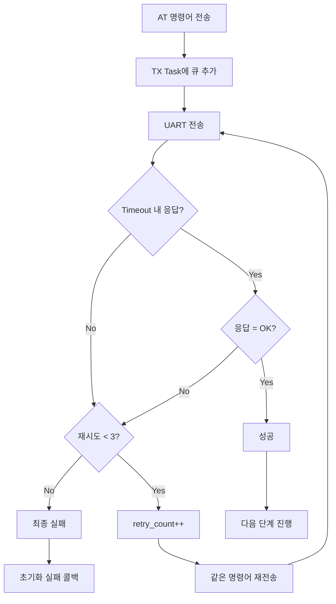

# LoRa 통신 가이드

## 목차
- [1. LoRa 통신 개요](#1-lora-통신-개요)
- [2. 시스템 아키텍처](#2-시스템-아키텍처)
- [3. LoRa P2P 모드](#3-lora-p2p-모드)
- [4. API 레퍼런스](#4-api-레퍼런스)
- [5. AT 명령어](#5-at-명령어)
- [6. RTCM 데이터 전송](#6-rtcm-데이터-전송)
- [7. 사용 예제](#7-사용-예제)
- [8. 트러블슈팅](#8-트러블슈팅)
- [9. 플로우 차트 및 다이어그램](#9-플로우-차트-및-다이어그램)

---

## 1. LoRa 통신 개요

### 1.1 LoRa란?

**LoRa (Long Range)**는 저전력, 장거리 무선 통신 기술로 다음과 같은 특징을 가집니다:

- **장거리 통신**: 최대 10~15km (환경에 따라 다름)
- **저전력**: 배터리 수명 최대화
- **낮은 데이터 전송률**: 수백 bps ~ 수십 kbps
- **침투력 우수**: 건물 내부까지 신호 도달 가능
- **라이센스 불필요**: ISM 대역 (868MHz, 915MHz, 923MHz 등) 사용

### 1.2 LoRa 통신 모드

본 프로젝트에서는 두 가지 LoRa 통신 모드를 지원합니다:

1. **LoRaWAN 모드** (Network Mode)
   - LoRaWAN 네트워크 서버(Gateway) 사용
   - 다중 노드 관리
   - 장거리 IoT 애플리케이션

2. **P2P 모드** (Peer-to-Peer Mode) ⭐ **본 프로젝트 사용**
   - 디바이스 간 직접 통신
   - 네트워크 인프라 불필요
   - BASE ↔ ROVER 간 RTCM 데이터 전송

### 1.3 프로젝트 사용 사례

본 프로젝트는 **GPS RTK (Real-Time Kinematic) 시스템**에서 LoRa P2P 통신을 사용합니다:

```
┌─────────────┐                        ┌─────────────┐
│   BASE      │  LoRa P2P (920.9MHz)  │   ROVER     │
│  Station    │ ──────────────────────> │   Device    │
│             │   RTCM Correction      │             │
│  GPS Module │      Data              │  GPS Module │
└─────────────┘                        └─────────────┘
```

- **BASE**: GPS 기준국 (RTCM correction data 송신)
- **ROVER**: 이동 단말 (RTCM correction data 수신 → GPS 정밀 측위)

---

## 2. 시스템 아키텍처

### 2.1 소프트웨어 구조

```
┌─────────────────────────────────────────────────────────┐
│                   Application Layer                      │
│  ┌────────────────┐         ┌──────────────────┐        │
│  │  GPS App       │         │   User App       │        │
│  │  (RTCM sender) │         │  (Custom logic)  │        │
│  └────────┬───────┘         └────────┬─────────┘        │
├───────────┼──────────────────────────┼──────────────────┤
│           │         LoRa App Layer   │                  │
│  ┌────────▼──────────────────────────▼─────────┐        │
│  │  lora_app.c / lora_app.h                    │        │
│  │  - P2P 송수신 API                            │        │
│  │  - RTCM fragment 재조립                      │        │
│  │  - AT 명령어 관리                            │        │
│  │  - FreeRTOS Task (RX/TX)                    │        │
│  └────────┬────────────────────────────────────┘        │
├───────────┼──────────────────────────────────────────────┤
│           │         LoRa Port Layer                      │
│  ┌────────▼────────────────────────────────────┐        │
│  │  lora_port.c / lora_port.h                  │        │
│  │  - UART3 하드웨어 초기화                     │        │
│  │  - DMA 수신 버퍼 관리                        │        │
│  │  - 인터럽트 핸들러                           │        │
│  └────────┬────────────────────────────────────┘        │
├───────────┼──────────────────────────────────────────────┤
│           │         HAL Layer                            │
│  ┌────────▼────────────────────────────────────┐        │
│  │  lora.c / lora.h                             │        │
│  │  - HAL 추상화 인터페이스                     │        │
│  │  - 하드웨어 독립적 API                       │        │
│  └─────────────────────────────────────────────┘        │
└──────────────────────────────────────────────────────────┘
           │
           ▼
    LoRa Module (RAK3172)
    UART3 @ 115200 bps
```

### 2.2 파일 구조

```
my_test2/
├── modules/lora/
│   ├── lora_app.h          # LoRa Application API (P2P, RTCM)
│   ├── lora_app.c          # LoRa Application 구현
│   ├── lora_port.h         # UART 포트 인터페이스
│   └── lora_port.c         # UART3 하드웨어 구현
└── lib/lora/
    ├── lora.h              # HAL 추상화 인터페이스
    └── lora.c              # HAL 구현
```

### 2.3 FreeRTOS Task 구조

본 프로젝트는 FreeRTOS 기반으로 다음 두 개의 Task를 사용합니다:

```
┌──────────────────────────────────────────────────────────┐
│  LoRa RX Task (lora_process_task)                        │
│  Priority: tskIDLE_PRIORITY + 3                          │
│  Stack: 1024 bytes                                       │
│                                                           │
│  - UART DMA 수신 인터럽트 처리                            │
│  - AT 명령어 응답 파싱 (OK/ERROR)                         │
│  - P2P 수신 데이터 파싱 (at+recv=...)                     │
│  - RTCM fragment 재조립                                   │
│  - GPS 모듈로 RTCM 데이터 전달                            │
└──────────────────────────────────────────────────────────┘

┌──────────────────────────────────────────────────────────┐
│  LoRa TX Task (lora_tx_task)                             │
│  Priority: tskIDLE_PRIORITY + 3                          │
│  Stack: 1024 bytes                                       │
│                                                           │
│  - AT 명령어 큐 처리                                      │
│  - UART 전송 (Mutex 보호)                                 │
│  - 응답 대기 (Timeout 관리)                               │
│  - ToA (Time on Air) 대기                                │
│  - 동기/비동기 콜백 처리                                  │
└──────────────────────────────────────────────────────────┘
```

---

## 3. LoRa P2P 모드

### 3.1 P2P 모드란?

**P2P (Peer-to-Peer) 모드**는 두 개의 LoRa 디바이스가 직접 통신하는 방식입니다:

- LoRaWAN Gateway 불필요
- 단순한 Point-to-Point 통신
- BASE (송신기) ↔ ROVER (수신기) 구조

### 3.2 P2P 설정 파라미터

본 프로젝트는 다음 P2P 설정을 사용합니다:

```c
// BASE 모드 초기화
at+set_config=lora:work_mode:1                          // P2P 모드
at+set_config=lorap2p:920900000:7:0:1:8:14             // P2P 파라미터
at+set_config=lorap2p:transfer_mode:2                  // BASE (송신)

// ROVER 모드 초기화
at+set_config=lora:work_mode:1                          // P2P 모드
at+set_config=lorap2p:920900000:7:0:1:8:14             // P2P 파라미터
at+set_config=lorap2p:transfer_mode:1                  // ROVER (수신)
```

#### 파라미터 설명

| 파라미터 | 값 | 설명 |
|---------|-----|------|
| **Frequency** | 920900000 | 주파수 (920.9 MHz, KR920 대역) |
| **Spreading Factor (SF)** | 7 | 확산 계수 (7~12, 낮을수록 빠름) |
| **Bandwidth (BW)** | 0 | 대역폭 (0=125kHz, 1=250kHz, 2=500kHz) |
| **Coding Rate (CR)** | 1 | 코딩률 (1=4/5, 2=4/6, 3=4/7, 4=4/8) |
| **Preamble Length** | 8 | Preamble 길이 (5~65535) |
| **TX Power** | 14 | 전송 출력 (5~20 dBm) |
| **Transfer Mode** | 1=ROVER, 2=BASE | 전송 모드 |

#### Spreading Factor (SF) 영향

SF는 데이터 전송률과 통신 거리에 큰 영향을 미칩니다:

| SF | 데이터 전송률 | 통신 거리 | ToA (Time on Air) |
|----|--------------|----------|-------------------|
| 7  | 최대 (~5.5 kbps) | 짧음 (~2km) | 짧음 (~40ms) |
| 8  | 높음 | 보통 | 보통 |
| 9  | 보통 | 보통 | 보통 |
| 10 | 낮음 | 김 (~10km) | 김 (~370ms) |
| 11 | 매우 낮음 | 매우 김 (~15km) | 매우 김 (~740ms) |
| 12 | 최저 (~290 bps) | 최대 (~20km) | 최대 (~1.5s) |

**본 프로젝트는 SF=7 사용** → 빠른 전송률, 짧은 ToA, 적당한 통신 거리

### 3.3 Transfer Mode

| Mode | 값 | 설명 | 역할 |
|------|---|------|-----|
| **RECEIVER** | 1 | 수신 모드 (연속 수신) | ROVER |
| **SENDER** | 2 | 송신 모드 (이벤트 기반) | BASE |

---

## 4. API 레퍼런스

### 4.1 초기화 API

#### `void lora_instance_init(void)`

LoRa 인스턴스를 초기화하고 FreeRTOS Task를 생성합니다.

**호출 시점**: `main()` 함수에서 FreeRTOS 시작 전

**동작**:
- UART3 하드웨어 초기화
- RX/TX 큐 생성
- RX/TX Task 생성
- BASE/ROVER 모드에 따라 자동 초기화

**예제**:
```c
int main(void) {
    HAL_Init();
    SystemClock_Config();

    // LoRa 초기화
    lora_instance_init();

    // FreeRTOS 시작
    vTaskStartScheduler();
}
```

---

### 4.2 동기 API

#### `bool lora_send_command_sync(const char *cmd, uint32_t timeout_ms)`

AT 명령어를 동기 방식으로 전송합니다 (blocking).

**파라미터**:
- `cmd`: AT 명령어 문자열 (예: `"at+version\r\n"`)
- `timeout_ms`: 타임아웃 (밀리초)

**반환값**:
- `true`: OK 응답 수신
- `false`: ERROR 또는 TIMEOUT

**예제**:
```c
// LoRa 버전 확인
if (lora_send_command_sync("at+version\r\n", 2000)) {
    LOG_INFO("Version command OK");
} else {
    LOG_ERR("Version command failed");
}
```

---

#### `bool lora_send_p2p_raw(const uint8_t *data, size_t len, uint32_t timeout_ms)`

바이너리 데이터를 P2P로 전송합니다 (동기).

**파라미터**:
- `data`: 전송할 바이너리 데이터
- `len`: 데이터 길이 (최대 118 bytes)
- `timeout_ms`: 타임아웃 (밀리초)

**반환값**:
- `true`: 전송 성공
- `false`: 전송 실패

**내부 동작**:
1. 바이너리 데이터를 HEX ASCII 문자열로 변환
   - 예: `0x48 0x65 0x6C 0x6C 0x6F` → `"48656C6C6F"`
2. AT 명령어 생성: `at+send=lorap2p:48656C6C6F\r\n`
3. UART 전송 및 OK 응답 대기

**예제**:
```c
uint8_t data[] = {0xD3, 0x00, 0x13, ...};  // RTCM 데이터
if (lora_send_p2p_raw(data, sizeof(data), 2000)) {
    LOG_INFO("RTCM data sent");
}
```

---

### 4.3 비동기 API

#### `bool lora_send_command_async(const char *cmd, uint32_t timeout_ms, uint32_t toa_ms, lora_command_callback_t callback, void *user_data, bool skip_response)`

AT 명령어를 비동기 방식으로 전송합니다 (non-blocking).

**파라미터**:
- `cmd`: AT 명령어 문자열
- `timeout_ms`: 타임아웃 (밀리초)
- `toa_ms`: Time on Air (공중 전파 시간, OK 응답 후 추가 대기)
- `callback`: 완료 콜백 함수
- `user_data`: 사용자 데이터 (콜백에 전달)
- `skip_response`: `true`이면 응답 파싱 건너뛰기

**반환값**:
- `true`: 큐에 추가 성공 (즉시 반환)
- `false`: 큐 추가 실패

**콜백 함수 시그니처**:
```c
typedef void (*lora_command_callback_t)(bool success, void *user_data);
```

**예제**:
```c
void send_complete_callback(bool success, void *user_data) {
    if (success) {
        LOG_INFO("Async command OK");
    } else {
        LOG_ERR("Async command failed");
    }
}

// 비동기 명령어 전송
lora_send_command_async("at+version\r\n", 2000, 0,
                        send_complete_callback, NULL, false);

// 즉시 다른 작업 수행 가능 (non-blocking)
LOG_INFO("Continue processing...");
```

---

#### `bool lora_send_p2p_raw_async(const uint8_t *data, size_t len, uint32_t timeout_ms, lora_command_callback_t callback, void *user_data)`

바이너리 데이터를 P2P로 비동기 전송합니다.

**파라미터**:
- `data`: 전송할 바이너리 데이터
- `len`: 데이터 길이 (최대 118 bytes)
- `timeout_ms`: 타임아웃 (밀리초)
- `callback`: 완료 콜백
- `user_data`: 사용자 데이터

**반환값**:
- `true`: 큐에 추가 성공
- `false`: 실패

**내부 ToA 계산**:
```c
// ToA = (bytes / 118) * 350ms * 1.2 (20% 마진)
uint32_t toa_ms = (len * 350 / 118) * 12 / 10;
if (toa_ms < 60) toa_ms = 60;  // 최소 60ms
```

**예제**:
```c
void rtcm_sent_callback(bool success, void *user_data) {
    if (success) {
        LOG_INFO("RTCM fragment sent");
    }
}

uint8_t rtcm_fragment[100] = {...};
lora_send_p2p_raw_async(rtcm_fragment, 100, 2000,
                         rtcm_sent_callback, NULL);
```

---

### 4.4 수신 콜백 등록

#### `void lora_set_p2p_recv_callback(lora_p2p_recv_callback_t callback, void *user_data)`

P2P 수신 데이터 콜백을 등록합니다.

**파라미터**:
- `callback`: 수신 콜백 (`NULL`이면 기본 RTCM 처리)
- `user_data`: 사용자 데이터

**콜백 함수 시그니처**:
```c
typedef void (*lora_p2p_recv_callback_t)(lora_p2p_recv_data_t *recv_data, void *user_data);

typedef struct {
    int16_t rssi;           // 수신 신호 강도 (dBm)
    int16_t snr;            // Signal-to-Noise Ratio (dB)
    uint16_t data_len;      // 데이터 길이
    char data[512];         // 수신 데이터 (바이너리)
} lora_p2p_recv_data_t;
```

**예제**:
```c
void custom_recv_callback(lora_p2p_recv_data_t *recv_data, void *user_data) {
    LOG_INFO("Received %d bytes, RSSI=%d dBm, SNR=%d dB",
             recv_data->data_len, recv_data->rssi, recv_data->snr);

    // 수신 데이터 처리
    process_received_data((uint8_t *)recv_data->data, recv_data->data_len);
}

// 콜백 등록
lora_set_p2p_recv_callback(custom_recv_callback, NULL);
```

**기본 동작 (콜백 `NULL` 시)**:
- RTCM fragment 자동 재조립
- 완전한 RTCM 패킷 검증 (CRC24Q)
- GPS 모듈로 자동 전송

---

### 4.5 설정 API

#### `bool lora_set_work_mode(lora_work_mode_t mode, uint32_t timeout_ms)`

LoRa 작동 모드를 설정합니다.

**파라미터**:
- `mode`: `LORA_WORK_MODE_LORAWAN (0)` 또는 `LORA_WORK_MODE_P2P (1)`
- `timeout_ms`: 타임아웃 (밀리초)

**예제**:
```c
// P2P 모드로 전환
lora_set_work_mode(LORA_WORK_MODE_P2P, 2000);
```

---

#### `bool lora_set_p2p_config(uint32_t freq, uint8_t sf, uint8_t bw, uint8_t cr, uint16_t preamlen, uint8_t pwr, uint32_t timeout_ms)`

P2P 통신 파라미터를 설정합니다.

**파라미터**:
- `freq`: 주파수 (Hz) - 예: `920900000` (920.9 MHz)
- `sf`: Spreading Factor (7~12)
- `bw`: Bandwidth (0=125kHz, 1=250kHz, 2=500kHz)
- `cr`: Coding Rate (1=4/5, 2=4/6, 3=4/7, 4=4/8)
- `preamlen`: Preamble Length (5~65535)
- `pwr`: TX Power (5~20 dBm)
- `timeout_ms`: 타임아웃 (밀리초)

**예제**:
```c
// P2P 설정: 920.9MHz, SF7, BW125kHz, CR4/5, Preamble8, 14dBm
lora_set_p2p_config(920900000, 7, 0, 1, 8, 14, 2000);
```

---

#### `bool lora_set_p2p_transfer_mode(lora_p2p_transfer_mode_t mode, uint32_t timeout_ms)`

P2P 전송 모드를 설정합니다.

**파라미터**:
- `mode`: `LORA_P2P_TRANSFER_MODE_RECEIVER (1)` 또는 `LORA_P2P_TRANSFER_MODE_SENDER (2)`
- `timeout_ms`: 타임아웃 (밀리초)

**예제**:
```c
// ROVER (수신기) 모드
lora_set_p2p_transfer_mode(LORA_P2P_TRANSFER_MODE_RECEIVER, 2000);

// BASE (송신기) 모드
lora_set_p2p_transfer_mode(LORA_P2P_TRANSFER_MODE_SENDER, 2000);
```

---

## 5. AT 명령어

### 5.1 기본 명령어

| 명령어 | 설명 | 응답 예제 |
|--------|------|----------|
| `at+version\r\n` | 펌웨어 버전 확인 | `OK V3.2.0.14` |
| `at+help\r\n` | 도움말 출력 | `OK` |
| `at+reset\r\n` | 모듈 재시작 | `OK` |

### 5.2 P2P 설정 명령어

#### Work Mode 설정
```
at+set_config=lora:work_mode:<mode>\r\n

mode:
  0 = LoRaWAN
  1 = P2P

응답: OK
```

#### P2P 파라미터 설정
```
at+set_config=lorap2p:<freq>:<sf>:<bw>:<cr>:<preamlen>:<pwr>\r\n

freq:       주파수 (Hz) - 예: 920900000
sf:         Spreading Factor (7~12)
bw:         Bandwidth (0=125kHz, 1=250kHz, 2=500kHz)
cr:         Coding Rate (1=4/5, 2=4/6, 3=4/7, 4=4/8)
preamlen:   Preamble Length (5~65535)
pwr:        TX Power (5~20 dBm)

응답: OK
```

**예제**:
```
at+set_config=lorap2p:920900000:7:0:1:8:14\r\n
→ OK
```

#### Transfer Mode 설정
```
at+set_config=lorap2p:transfer_mode:<mode>\r\n

mode:
  1 = RECEIVER (연속 수신)
  2 = SENDER (이벤트 기반 송신)

응답: OK
```

### 5.3 P2P 데이터 전송

#### HEX 문자열 전송
```
at+send=lorap2p:<hex_string>\r\n

hex_string: HEX ASCII 문자열 (최대 236자 = 118 bytes)

응답: OK
```

**예제**:
```
// "Hello" 전송 (ASCII: 48 65 6C 6C 6F)
at+send=lorap2p:48656C6C6F\r\n
→ OK
```

### 5.4 P2P 데이터 수신

RECEIVER 모드에서 데이터 수신 시 자동으로 출력됩니다:

```
at+recv=<rssi>,<snr>,<len>:<hex_data>

rssi:     수신 신호 강도 (dBm, 음수)
snr:      Signal-to-Noise Ratio (dB)
len:      데이터 길이 (bytes)
hex_data: HEX ASCII 문자열
```

**예제**:
```
at+recv=-50,10,5:48656C6C6F
```

파싱 결과:
- RSSI: -50 dBm
- SNR: 10 dB
- Length: 5 bytes
- Data: `0x48 0x65 0x6C 0x6C 0x6F` (= "Hello")

---

## 6. RTCM 데이터 전송

### 6.1 RTCM 프로토콜 개요

**RTCM (Radio Technical Commission for Maritime Services)**는 GPS RTK 보정 데이터 전송을 위한 표준 프로토콜입니다.

#### RTCM 패킷 구조

```
┌─────────┬─────────────┬──────────┬──────────┐
│ Preamble│ Reserved+Len│ Payload  │ CRC24Q   │
│ (1 byte)│  (2 bytes)  │ (N bytes)│ (3 bytes)│
└─────────┴─────────────┴──────────┴──────────┘
   0xD3      10-bit len   Message    24-bit CRC
```

**구성 요소**:
1. **Preamble**: 고정값 `0xD3`
2. **Reserved (6 bits)**: 예약 영역 (보통 `0`)
3. **Length (10 bits)**: Payload 길이 (최대 1023 bytes)
4. **Payload**: RTCM 메시지 (Message Type + Data)
5. **CRC24Q**: 24-bit 체크섬 (polynomial: `0x1864CFB`)

**예제**:
```
D3 00 13 ... (payload 19 bytes) ... XX XX XX (CRC)
│  │  │
│  │  └─ Length (low 8 bits) = 0x13 (19 bytes)
│  └──── Reserved + Length (high 2 bits) = 0x00
└─────── Preamble = 0xD3
```

### 6.2 Fragment 재조립 (Reassembly)

LoRa P2P는 한 번에 최대 **118 bytes**까지만 전송 가능합니다.

RTCM 패킷이 118 bytes를 초과하면 **여러 fragment로 분할하여 전송**하고, 수신측에서 재조립합니다.

#### 재조립 프로세스

```
Fragment 1: [D3 00 13 ... (100 bytes)]
                ↓
Fragment 2: [... (18 bytes)]
                ↓
        Reassembly Buffer
                ↓
   [D3 00 13 ... (118 bytes total)]
                ↓
        CRC24Q Validation
                ↓
      GPS Module (RTCM injection)
```

#### 재조립 버퍼 구조

```c
typedef struct {
    uint8_t buffer[1024];       // 재조립 버퍼
    uint16_t buffer_pos;        // 현재 버퍼 위치
    uint16_t expected_len;      // 예상 전체 길이
    bool has_header;            // 헤더 수신 완료 여부
    TickType_t last_recv_tick;  // 마지막 수신 시간 (타임아웃 감지)
} rtcm_reassembly_t;
```

#### 재조립 알고리즘

1. **Preamble 탐색**: 수신된 데이터에서 `0xD3` 검색
2. **헤더 파싱**: Length 필드 읽기 → 예상 전체 길이 계산
3. **Fragment 누적**: 재조립 버퍼에 데이터 추가
4. **완료 체크**: `buffer_pos >= expected_len`이면 완료
5. **CRC 검증**: CRC24Q 체크섬 확인
6. **GPS 전송**: 유효한 RTCM 패킷을 GPS 모듈로 전송
7. **남은 데이터 처리**: 버퍼에 남은 바이트는 다음 패킷의 시작일 수 있음

#### 타임아웃 처리

- **타임아웃 값**: 5초 (`RTCM_REASSEMBLY_TIMEOUT_MS`)
- 마지막 수신 후 5초 경과 시 재조립 버퍼 초기화
- 불완전한 fragment 방지

#### CRC24Q 계산

```c
static uint32_t rtcm_crc24q(const uint8_t *buffer, size_t len) {
    uint32_t crc = 0;

    for (size_t i = 0; i < len; i++) {
        crc ^= ((uint32_t)buffer[i]) << 16;

        for (int j = 0; j < 8; j++) {
            crc <<= 1;
            if (crc & 0x1000000) {
                crc ^= 0x1864CFB;  // CRC24Q polynomial
            }
        }
    }

    return crc & 0xFFFFFF;
}
```

### 6.3 BASE → ROVER 데이터 흐름

```
┌─────────────────────────────────────────────────────────────┐
│  BASE Station                                                │
│                                                               │
│  GPS Module (RTCM generation)                                │
│       │                                                       │
│       ▼                                                       │
│  RTCM Fragmenter (split into 118-byte chunks)                │
│       │                                                       │
│       ▼                                                       │
│  LoRa P2P TX (920.9 MHz, SF7)                                │
└───────┼───────────────────────────────────────────────────────┘
        │ (Wireless)
        ▼
┌───────┼───────────────────────────────────────────────────────┐
│  ROVER Device                                                 │
│       │                                                       │
│       ▼                                                       │
│  LoRa P2P RX                                                  │
│       │                                                       │
│       ▼                                                       │
│  RTCM Reassembly Buffer                                       │
│       │                                                       │
│       ▼                                                       │
│  CRC24Q Validation                                            │
│       │                                                       │
│       ▼                                                       │
│  GPS Module (RTK correction)                                  │
└───────────────────────────────────────────────────────────────┘
```

---

## 7. 사용 예제

### 7.1 기본 초기화 (BASE)

```c
#include "lora_app.h"

int main(void) {
    // 시스템 초기화
    HAL_Init();
    SystemClock_Config();
    MX_GPIO_Init();
    MX_USART3_UART_Init();

    // Board 설정 (BASE 모드)
    board_config_t config = {
        .lora_mode = LORA_MODE_BASE,
    };
    board_set_config(&config);

    // LoRa 초기화
    lora_instance_init();

    // FreeRTOS 시작
    vTaskStartScheduler();

    while (1);
}
```

### 7.2 기본 초기화 (ROVER)

```c
int main(void) {
    // 시스템 초기화
    HAL_Init();
    SystemClock_Config();
    MX_GPIO_Init();
    MX_USART3_UART_Init();

    // Board 설정 (ROVER 모드)
    board_config_t config = {
        .lora_mode = LORA_MODE_ROVER,
    };
    board_set_config(&config);

    // LoRa 초기화
    lora_instance_init();

    // FreeRTOS 시작
    vTaskStartScheduler();

    while (1);
}
```

### 7.3 BASE: RTCM 데이터 전송

```c
void gps_rtcm_ready_callback(uint8_t *rtcm_data, size_t len, void *user_data) {
    LOG_INFO("GPS RTCM data ready: %d bytes", len);

    // RTCM 데이터를 fragment로 분할 전송
    const size_t MAX_FRAGMENT_SIZE = 118;
    size_t offset = 0;

    while (offset < len) {
        size_t fragment_size = (len - offset > MAX_FRAGMENT_SIZE)
                                ? MAX_FRAGMENT_SIZE
                                : (len - offset);

        // Fragment 전송 (비동기)
        if (!lora_send_p2p_raw_async(&rtcm_data[offset], fragment_size, 2000,
                                     fragment_sent_callback, NULL)) {
            LOG_ERR("Failed to send RTCM fragment");
            break;
        }

        offset += fragment_size;
        LOG_INFO("Sent fragment %d bytes (total: %d/%d)",
                 fragment_size, offset, len);
    }
}

void fragment_sent_callback(bool success, void *user_data) {
    if (success) {
        LOG_INFO("RTCM fragment sent successfully");
    } else {
        LOG_ERR("RTCM fragment transmission failed");
    }
}
```

### 7.4 ROVER: RTCM 데이터 수신 (자동)

ROVER 모드에서는 **별도 코드 불필요**합니다.

`lora_app.c` 내부에서 자동으로:
1. P2P 수신 데이터 파싱
2. RTCM fragment 재조립
3. CRC24Q 검증
4. GPS 모듈로 자동 전송

### 7.5 커스텀 수신 콜백

```c
void custom_recv_handler(lora_p2p_recv_data_t *recv_data, void *user_data) {
    LOG_INFO("P2P data received:");
    LOG_INFO("  RSSI: %d dBm", recv_data->rssi);
    LOG_INFO("  SNR: %d dB", recv_data->snr);
    LOG_INFO("  Length: %d bytes", recv_data->data_len);

    // 수신 데이터 처리 (HEX 출력)
    LOG_INFO("  Data (HEX):");
    for (uint16_t i = 0; i < recv_data->data_len; i++) {
        printf("%02X ", (uint8_t)recv_data->data[i]);
        if ((i + 1) % 16 == 0) printf("\n");
    }
    printf("\n");

    // 커스텀 프로토콜 처리
    if (recv_data->data[0] == 0xAA && recv_data->data[1] == 0xBB) {
        process_custom_protocol((uint8_t *)recv_data->data, recv_data->data_len);
    }
}

// 메인 초기화에서 콜백 등록
lora_set_p2p_recv_callback(custom_recv_handler, NULL);
```

### 7.6 동기 vs 비동기 전송

#### 동기 전송 (Blocking)

```c
// Task에서 사용 (다른 Task는 계속 실행)
void lora_send_task(void *pvParameter) {
    uint8_t data[] = {0x01, 0x02, 0x03, 0x04};

    while (1) {
        LOG_INFO("Sending data...");

        // Blocking 전송 (OK 응답 대기)
        if (lora_send_p2p_raw(data, sizeof(data), 2000)) {
            LOG_INFO("Data sent successfully");
        } else {
            LOG_ERR("Failed to send data");
        }

        vTaskDelay(pdMS_TO_TICKS(5000));  // 5초 대기
    }
}
```

#### 비동기 전송 (Non-blocking)

```c
void send_complete(bool success, void *user_data) {
    int *counter = (int *)user_data;

    if (success) {
        LOG_INFO("Packet %d sent", *counter);
    } else {
        LOG_ERR("Packet %d failed", *counter);
    }
}

void lora_send_task(void *pvParameter) {
    uint8_t data[] = {0x01, 0x02, 0x03, 0x04};
    int counter = 0;

    while (1) {
        counter++;

        // Non-blocking 전송 (즉시 반환)
        lora_send_p2p_raw_async(data, sizeof(data), 2000,
                                 send_complete, &counter);

        // 즉시 다른 작업 수행 가능
        LOG_INFO("Continue other tasks...");
        do_other_work();

        vTaskDelay(pdMS_TO_TICKS(1000));
    }
}
```

### 7.7 TX 테스트 모드

```c
// 10초마다 "hello world" 전송
void start_lora_tx_test(void) {
    lora_start_tx_test();
}
```

---

## 8. 트러블슈팅

### 8.1 초기화 실패

**증상**:
```
[ERROR] LoRa init failed at step 1/3 after 3 retries
```

**원인**:
- UART3 연결 불량
- LoRa 모듈 전원 문제
- Baudrate 불일치 (115200 bps)

**해결 방법**:
1. UART3 연결 확인 (TX/RX/GND)
2. LoRa 모듈 전원 확인 (3.3V)
3. `at+version\r\n` 명령어로 수동 테스트
4. 시리얼 터미널에서 응답 확인

---

### 8.2 데이터 수신 안 됨

**증상**:
```
[WARN] Ignoring P2P data during initialization
```

**원인**:
- 초기화 완료 전 수신 데이터 무시
- BASE와 ROVER의 주파수/SF 불일치

**해결 방법**:
1. 초기화 완료 로그 확인:
   ```
   [INFO] LoRa init complete - now accepting P2P data
   ```
2. BASE와 ROVER의 P2P 설정 일치 확인:
   - 주파수: 920.9 MHz
   - SF: 7
   - BW: 125 kHz
   - CR: 4/5

---

### 8.3 RTCM 재조립 실패

**증상**:
```
[ERROR] RTCM CRC mismatch: calculated 0x123456, received 0xABCDEF
```

**원인**:
- Fragment 손실
- Fragment 순서 뒤바뀜
- 무선 간섭

**해결 방법**:
1. RSSI/SNR 확인 (너무 낮으면 전송 실패 가능)
   ```
   [INFO] P2P recv: RSSI=-50, SNR=10  // Good
   [INFO] P2P recv: RSSI=-120, SNR=-5  // Bad
   ```
2. TX Power 증가 (14 dBm → 20 dBm)
3. SF 증가 (SF7 → SF10, 통신 거리 증가)
4. 재조립 타임아웃 확인 (5초)

---

### 8.4 전송 속도 느림

**증상**:
- 118 bytes 전송 시 1초 이상 소요

**원인**:
- SF가 높음 (SF10~12)
- ToA (Time on Air)가 김

**해결 방법**:
1. SF 감소 (SF10 → SF7)
   - SF7: ~40ms ToA (118 bytes)
   - SF10: ~370ms ToA (118 bytes)
2. BW 증가 (125 kHz → 250 kHz)
3. 비동기 전송 사용 (`lora_send_p2p_raw_async`)

---

### 8.5 UART 충돌

**증상**:
```
[ERROR] LoRa send ops not available
```

**원인**:
- UART Mutex 타임아웃
- UART 하드웨어 초기화 실패

**해결 방법**:
1. `lora_port_init_instance()` 호출 확인
2. UART3 하드웨어 설정 확인:
   - Baudrate: 115200
   - Data bits: 8
   - Stop bits: 1
   - Parity: None
3. DMA 초기화 확인

---

### 8.6 메모리 부족

**증상**:
```
[ERROR] Failed to allocate LoRa init context
```

**원인**:
- FreeRTOS Heap 부족
- Task Stack 오버플로우

**해결 방법**:
1. `configTOTAL_HEAP_SIZE` 증가 (FreeRTOSConfig.h)
2. Task Stack 크기 확인:
   - RX Task: 1024 bytes
   - TX Task: 1024 bytes
3. `vTaskList()` 사용하여 메모리 사용량 모니터링

---

### 8.7 디버깅 로그 활성화

```c
// log.h
#define LOG_LEVEL_DEBUG  // 모든 로그 출력

// 로그 출력 예제
LOG_DEBUG("LoRa RX buffer: %d bytes", buffer_pos);
LOG_INFO("RTCM packet valid: len=%d", len);
LOG_WARN("RTCM reassembly timeout - resetting buffer");
LOG_ERR("Failed to send P2P data");
```

---

## 9. 플로우 차트 및 다이어그램

### 9.1 전체 시스템 초기화 플로우



### 9.2 LoRa BASE 초기화 시퀀스



### 9.3 TX Task 처리 플로우



### 9.4 RX Task 처리 플로우



### 9.5 RTCM Fragment 재조립 플로우



### 9.6 동기 vs 비동기 전송 비교



### 9.7 P2P 데이터 송수신 시퀀스



### 9.8 AT 명령어 재시도 메커니즘



### 9.9 메모리 레이아웃

#### 재조립 버퍼 구조

```
┌─────────────────────────────────────────────────────────────┐
│  rtcm_reassembly_t (1032 bytes)                              │
├─────────────────────────────────────────────────────────────┤
│  buffer[1024]                                                │
│  ┌──────────────────────────────────────────────────────┐   │
│  │ [D3][00][13][ Payload ... ][CRC][CRC][CRC]          │   │
│  │  ^                                        ^          │   │
│  │  Preamble                                 CRC24Q     │   │
│  └──────────────────────────────────────────────────────┘   │
│  buffer_pos:      118 (현재 위치)                            │
│  expected_len:    200 (예상 전체 길이)                       │
│  has_header:      true                                       │
│  last_recv_tick:  12345 (FreeRTOS tick)                      │
└─────────────────────────────────────────────────────────────┘
```

#### FreeRTOS Queue 구조

```
┌─────────────────────────────────────────────────────────────┐
│  cmd_queue (TX 명령어 큐)                                     │
│  Size: 20                                                    │
│  Item Size: sizeof(lora_cmd_request_t) = 296 bytes          │
├─────────────────────────────────────────────────────────────┤
│  [CMD 1: at+version\r\n        ]                             │
│  [CMD 2: at+send=lorap2p:...   ]                             │
│  [CMD 3: at+set_config=...     ]                             │
│  [...                          ]                             │
└─────────────────────────────────────────────────────────────┘

┌─────────────────────────────────────────────────────────────┐
│  queue (RX 이벤트 큐)                                         │
│  Size: 10                                                    │
│  Item Size: sizeof(uint8_t) = 1 byte                        │
├─────────────────────────────────────────────────────────────┤
│  [0x01] [0x01] [0x01] ...                                    │
│  (DMA 인터럽트 알림용 더미 데이터)                             │
└─────────────────────────────────────────────────────────────┘
```

### 9.10 RTCM 패킷 실제 예제

#### RTCM 1005 패킷 (Antenna Reference Point)

```
바이너리 (HEX):
D3 00 13 3E D0 00 03 8A 2D E4 F7 10 9D 54 60 00 00 1C 0C 10 FA 01 89 A4 5C

분석:
┌──────────┬────────────────────────────────────────────────────┐
│ 바이트   │ 설명                                                │
├──────────┼────────────────────────────────────────────────────┤
│ D3       │ Preamble (고정)                                     │
│ 00 13    │ Reserved(6bit) + Length(10bit) = 19 bytes payload  │
│ 3E D0... │ Payload (Message Type 1005 + Data, 19 bytes)       │
│ 89 A4 5C │ CRC24Q (24-bit)                                     │
└──────────┴────────────────────────────────────────────────────┘

Length 파싱:
  Byte 1: 0x00 = 0000 0000
  Byte 2: 0x13 = 0001 0011

  Reserved (6 bits): 000000
  Length (10 bits):  00 0001 0011 = 19 (decimal)

  Expected total length = 3 + 19 + 3 = 25 bytes ✓

HEX ASCII 변환 (LoRa 전송용):
  D300133ED00003... → "D300133ED00003..."
  25 bytes → 50 characters (HEX ASCII)

LoRa 전송:
  at+send=lorap2p:D300133ED00003...89A45C\r\n
```

---

## 부록

### A. LoRa 용어 정리

| 용어 | 설명 |
|-----|------|
| **SF (Spreading Factor)** | 확산 계수 (7~12, 높을수록 통신 거리 ↑, 속도 ↓) |
| **BW (Bandwidth)** | 대역폭 (125/250/500 kHz, 넓을수록 속도 ↑, 거리 ↓) |
| **CR (Coding Rate)** | 코딩률 (4/5~4/8, 높을수록 에러 정정 능력 ↑) |
| **ToA (Time on Air)** | 패킷 전송 시간 (공중 전파 시간) |
| **RSSI** | 수신 신호 강도 (dBm, -120 ~ 0, 높을수록 좋음) |
| **SNR** | Signal-to-Noise Ratio (dB, 높을수록 좋음) |
| **P2P** | Peer-to-Peer (직접 통신) |
| **LoRaWAN** | LoRa 네트워크 프로토콜 (Gateway 사용) |

### B. 주파수 대역

| 지역 | 주파수 대역 | 비고 |
|-----|-----------|------|
| **한국 (KR920)** | 920.9 ~ 923.3 MHz | 본 프로젝트 사용 |
| 유럽 (EU868) | 863 ~ 870 MHz | - |
| 북미 (US915) | 902 ~ 928 MHz | - |
| 중국 (CN470) | 470 ~ 510 MHz | - |
| 일본 (AS923) | 923 ~ 925 MHz | - |

### C. SF별 성능 비교 (BW=125kHz, Payload=118 bytes)

| SF | 전송률 (bps) | ToA (ms) | 통신 거리 (km) | 비고 |
|----|------------|---------|---------------|-----|
| 7  | ~5,470 | ~40 | ~2 | 빠름, 짧은 거리 |
| 8  | ~3,125 | ~72 | ~4 | - |
| 9  | ~1,760 | ~144 | ~6 | - |
| 10 | ~980 | ~288 | ~10 | 본 프로젝트 권장 |
| 11 | ~440 | ~576 | ~15 | 느림, 긴 거리 |
| 12 | ~290 | ~1,155 | ~20 | 매우 느림, 최대 거리 |

### D. 참고 문서

- [RAK3172 Datasheet](https://docs.rakwireless.com/Product-Categories/WisDuo/RAK3172-Module/Datasheet/)
- [RAK3172 AT Command Manual](https://docs.rakwireless.com/Product-Categories/WisDuo/RAK3172-Module/AT-Command-Manual/)
- [RTCM 10403.3 Standard](https://www.rtcm.org/)
- [LoRa Alliance](https://lora-alliance.org/)

---

**문서 버전**: 1.0
**최종 수정**: 2025-11-30
**작성자**: LoRa Communication Guide