# STM32 LTE/GSM 시스템 - 완벽 동작 분석 문서

## 목차
1. [전체 시스템 아키텍처](#1-전체-시스템-아키텍처)
2. [부팅 시퀀스](#2-부팅-시퀀스)
3. [AT 명령 처리 메커니즘](#3-at-명령-처리-메커니즘)
4. [TCP 통신 흐름](#4-tcp-통신-흐름)
5. [LTE 초기화 상태 머신](#5-lte-초기화-상태-머신)
6. [DMA 순환 버퍼 동작](#6-dma-순환-버퍼-동작)
7. [Producer-Consumer 패턴](#7-producer-consumer-패턴)
8. [인터럽트 및 동기화](#8-인터럽트-및-동기화)
9. [주요 데이터 구조](#9-주요-데이터-구조)
10. [코드 실행 흐름 상세](#10-코드-실행-흐름-상세)

---

## 1. 전체 시스템 아키텍처

### 시스템 레이어 구조

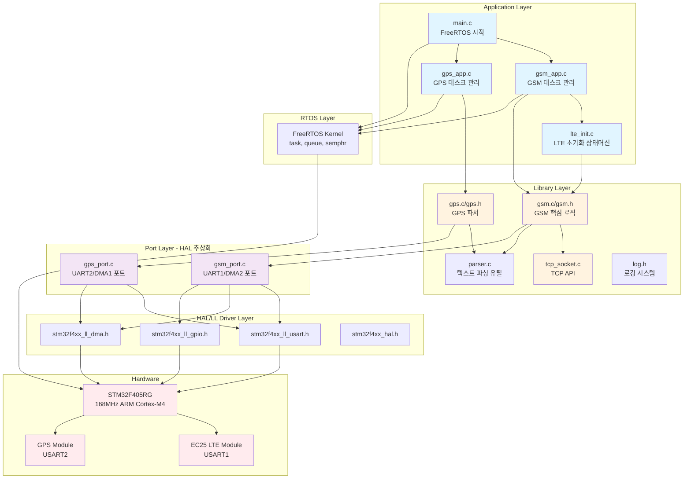
```mermaid
graph TB
    subgraph "Application Layer"
        A1[main.c<br/>FreeRTOS 시작]
        A2[gsm_app.c<br/>GSM 태스크 관리]
        A3[gps_app.c<br/>GPS 태스크 관리]
        A4[lte_init.c<br/>LTE 초기화 상태머신]
    end

    subgraph "Library Layer"
        L1[gsm.c/gsm.h<br/>GSM 핵심 로직]
        L2[tcp_socket.c<br/>TCP API]
        L3[gps.c/gps.h<br/>GPS 파서]
        L4[parser.c<br/>텍스트 파싱 유틸]
        L5[log.h<br/>로깅 시스템]
    end

    subgraph "Port Layer - HAL 추상화"
        P1[gsm_port.c<br/>UART1/DMA2 포트]
        P2[gps_port.c<br/>UART2/DMA1 포트]
    end

    subgraph "HAL/LL Driver Layer"
        H1[stm32f4xx_ll_usart.h]
        H2[stm32f4xx_ll_dma.h]
        H3[stm32f4xx_ll_gpio.h]
        H4[stm32f4xx_hal.h]
    end

    subgraph "RTOS Layer"
        R1[FreeRTOS Kernel<br/>task, queue, semphr]
    end

    subgraph "Hardware"
        HW1[STM32F405RG<br/>168MHz ARM Cortex-M4]
        HW2[EC25 LTE Module<br/>USART1]
        HW3[GPS Module<br/>USART2]
    end

    A1 --> A2
    A1 --> A3
    A2 --> A4
    A2 --> L1
    A3 --> L3
    A4 --> L1
    L1 --> L2
    L1 --> L4
    L3 --> L4
    L1 --> P1
    L3 --> P2
    P1 --> H1
    P1 --> H2
    P1 --> H3
    P2 --> H1
    P2 --> H2
    H1 --> HW1
    H2 --> HW1
    H3 --> HW1
    HW1 --> HW2
    HW1 --> HW3
    A1 --> R1
    A2 --> R1
    A3 --> R1
    R1 --> HW1

    style A1 fill:#e1f5ff
    style A2 fill:#e1f5ff
    style A3 fill:#e1f5ff
    style A4 fill:#e1f5ff
    style L1 fill:#fff3e0
    style L2 fill:#fff3e0
    style L3 fill:#fff3e0
    style P1 fill:#f3e5f5
    style P2 fill:#f3e5f5
    style HW1 fill:#ffebee
    style HW2 fill:#ffebee
    style HW3 fill:#ffebee
```

### 태스크 구조

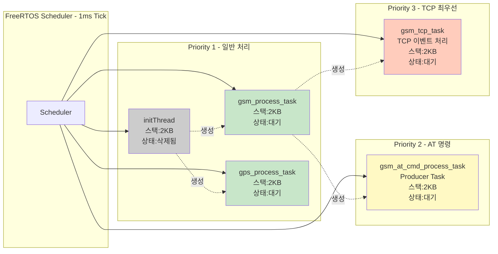
```mermaid
graph LR
    subgraph "FreeRTOS Scheduler - 1ms Tick"
        S[Scheduler]
    end

    subgraph "Priority 1 - 일반 처리"
        T1[initThread<br/>스택:2KB<br/>상태:삭제됨]
        T2[gsm_process_task<br/>스택:2KB<br/>상태:대기]
        T3[gps_process_task<br/>스택:2KB<br/>상태:대기]
    end

    subgraph "Priority 2 - AT 명령"
        T4[gsm_at_cmd_process_task<br/>Producer Task<br/>스택:2KB<br/>상태:대기]
    end

    subgraph "Priority 3 - TCP 최우선"
        T5[gsm_tcp_task<br/>TCP 이벤트 처리<br/>스택:2KB<br/>상태:대기]
    end

    S --> T1
    S --> T2
    S --> T3
    S --> T4
    S --> T5

    T1 -.생성.-> T2
    T1 -.생성.-> T3
    T2 -.생성.-> T4
    T2 -.생성.-> T5

    style T1 fill:#cccccc
    style T2 fill:#c8e6c9
    style T3 fill:#c8e6c9
    style T4 fill:#fff9c4
    style T5 fill:#ffccbc
```

---

## 2. 부팅 시퀀스

### 전체 부팅 흐름

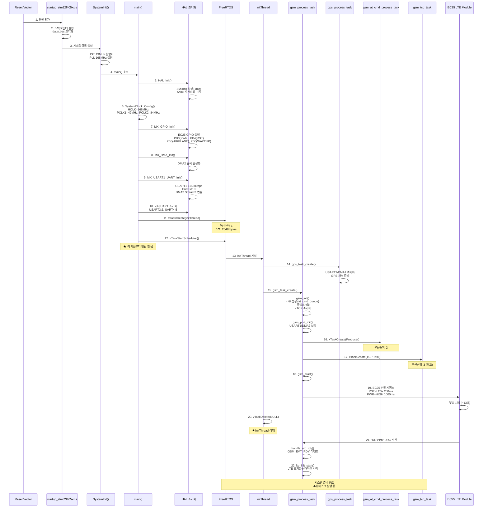
```mermaid
sequenceDiagram
    participant Reset as Reset Vector
    participant Startup as startup_stm32f405xx.s
    participant SystemInit as SystemInit()
    participant Main as main()
    participant HAL as HAL 초기화
    participant FreeRTOS as FreeRTOS
    participant InitTask as initThread
    participant GSM as gsm_process_task
    participant GPS as gps_process_task
    participant Producer as gsm_at_cmd_process_task
    participant TCP as gsm_tcp_task
    participant EC25 as EC25 LTE Module

    Reset->>Startup: 1. 전원 인가
    Startup->>Startup: 2. 스택 포인터 설정<br/>.data/.bss 초기화
    Startup->>SystemInit: 3. 시스템 클록 설정
    SystemInit->>SystemInit: HSE 13MHz 활성화<br/>PLL 168MHz 설정
    SystemInit->>Main: 4. main() 호출

    Main->>HAL: 5. HAL_Init()
    HAL->>HAL: SysTick 설정 (1ms)<br/>NVIC 우선순위 그룹

    Main->>Main: 6. SystemClock_Config()<br/>HCLK=168MHz<br/>PCLK1=42MHz, PCLK2=84MHz

    Main->>HAL: 7. MX_GPIO_Init()
    HAL->>HAL: EC25 GPIO 설정<br/>PB3(PWR), PB4(RST)<br/>PB5(AIRPLANE), PB6(WAKEUP)

    Main->>HAL: 8. MX_DMA_Init()
    HAL->>HAL: DMA2 클록 활성화

    Main->>HAL: 9. MX_USART1_UART_Init()
    HAL->>HAL: USART1 115200bps<br/>PA9/PA10<br/>DMA2 Stream2 연결

    Main->>HAL: 10. 기타 UART 초기화<br/>USART3,6, UART4,5

    Main->>FreeRTOS: 11. xTaskCreate(initThread)
    Note over FreeRTOS: 우선순위: 1<br/>스택: 2048 bytes

    Main->>FreeRTOS: 12. vTaskStartScheduler()
    Note over Main: ★ 이 시점부터 반환 안 됨

    FreeRTOS->>InitTask: 13. initThread 시작

    InitTask->>GPS: 14. gps_task_create()
    GPS->>GPS: USART2/DMA1 초기화<br/>GPS 파서 준비

    InitTask->>GSM: 15. gsm_task_create()
    GSM->>GSM: gsm_init()<br/>- 큐 생성 (at_cmd_queue)<br/>- 뮤텍스 생성<br/>- TCP 초기화
    GSM->>GSM: gsm_port_init()<br/>USART1/DMA2 설정

    GSM->>Producer: 16. xTaskCreate(Producer)
    Note over Producer: 우선순위: 2

    GSM->>TCP: 17. xTaskCreate(TCP Task)
    Note over TCP: 우선순위: 3 (최고)

    GSM->>GSM: 18. gsm_start()
    GSM->>EC25: 19. EC25 전원 시퀀스<br/>RST=LOW 200ms<br/>PWR=HIGH 1000ms
    EC25->>EC25: 부팅 시작 (~13초)

    InitTask->>InitTask: 20. vTaskDelete(NULL)
    Note over InitTask: ★ initThread 삭제

    EC25->>GSM: 21. "RDY\r\n" URC 수신
    GSM->>GSM: handle_urc_rdy()<br/>GSM_EVT_RDY 이벤트
    GSM->>GSM: 22. lte_init_start()<br/>LTE 초기화 상태머신 시작

    Note over FreeRTOS,TCP: 시스템 준비 완료<br/>4개 태스크 실행 중
```

### 상세 초기화 타이밍


```mermaid
gantt
    title STM32 부팅 및 초기화 타임라인
    dateFormat X
    axisFormat %L ms

    section Reset & Clock
    Reset Vector          :0, 1
    Startup Assembly      :1, 3
    SystemInit (Clock)    :4, 10

    section HAL 초기화
    HAL_Init              :10, 15
    SystemClock_Config    :15, 20
    GPIO 초기화           :20, 25
    DMA 초기화            :25, 30
    USART 초기화          :30, 50

    section FreeRTOS
    Task 생성             :50, 60
    vTaskStartScheduler   :60, 65

    section Application
    initThread 실행       :65, 100
    GPS Task 생성         :70, 80
    GSM Task 생성         :80, 100
    gsm_init()            :85, 95
    gsm_port_init()       :95, 105

    section EC25 Module
    EC25 전원 ON          :105, 110
    EC25 부팅             :110, 13110
    RDY URC 수신          :13110, 13115

    section LTE 초기화
    LTE 초기화 시작       :13115, 13120
    AT 테스트             :13120, 13420
    CMEE 설정             :13420, 13720
    CPIN 확인             :13720, 18720
    APN 설정              :18720, 19020
    APN 확인              :19020, 19320
    네트워크 등록         :19320, 199320
```

---

## 3. AT 명령 처리 메커니즘

### AT 명령 전체 흐름

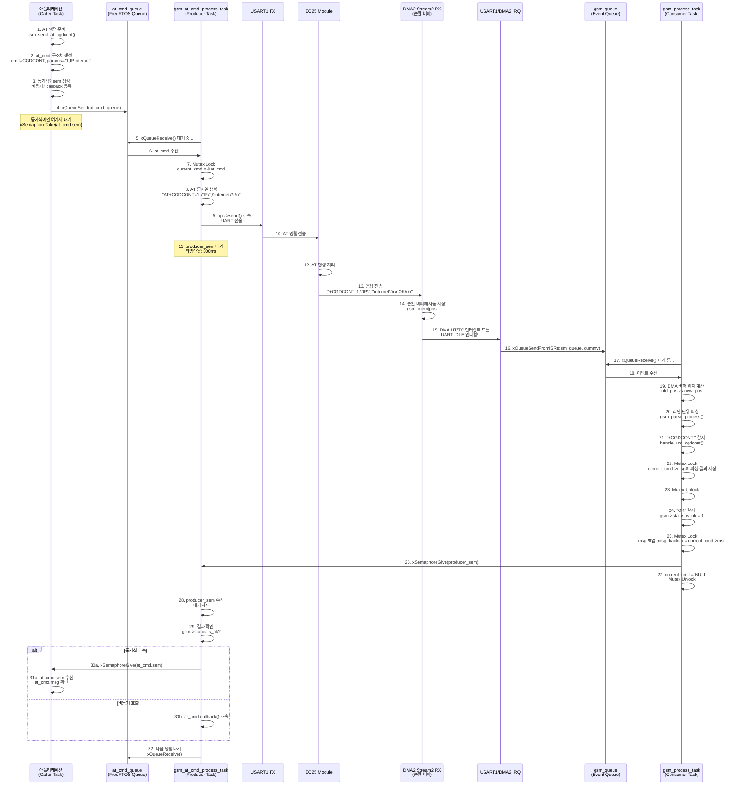
```mermaid
sequenceDiagram
    participant App as 애플리케이션<br/>(Caller Task)
    participant Queue as at_cmd_queue<br/>(FreeRTOS Queue)
    participant Producer as gsm_at_cmd_process_task<br/>(Producer Task)
    participant UART as USART1 TX
    participant EC25 as EC25 Module
    participant DMA as DMA2 Stream2 RX<br/>(순환 버퍼)
    participant IRQ as USART1/DMA2 IRQ
    participant EventQueue as gsm_queue<br/>(Event Queue)
    participant Consumer as gsm_process_task<br/>(Consumer Task)

    App->>App: 1. AT 명령 준비<br/>gsm_send_at_cgdcont()
    App->>App: 2. at_cmd 구조체 생성<br/>cmd=CGDCONT, params="1,IP,internet"
    App->>App: 3. 동기식? sem 생성<br/>비동기? callback 등록
    App->>Queue: 4. xQueueSend(at_cmd_queue)
    Note over App: 동기식이면 여기서 대기<br/>xSemaphoreTake(at_cmd.sem)

    Producer->>Queue: 5. xQueueReceive() 대기 중...
    Queue->>Producer: 6. at_cmd 수신
    Producer->>Producer: 7. Mutex Lock<br/>current_cmd = &at_cmd
    Producer->>Producer: 8. AT 문자열 생성<br/>"AT+CGDCONT=1,\"IP\",\"internet\"\r\n"
    Producer->>UART: 9. ops->send() 호출<br/>UART 전송
    UART->>EC25: 10. AT 명령 전송

    Note over Producer: 11. producer_sem 대기<br/>타임아웃: 300ms

    EC25->>EC25: 12. AT 명령 처리
    EC25->>DMA: 13. 응답 전송<br/>"+CGDCONT: 1,\"IP\",\"internet\"\r\nOK\r\n"
    DMA->>DMA: 14. 순환 버퍼에 자동 저장<br/>gsm_mem[pos]
    DMA->>IRQ: 15. DMA HT/TC 인터럽트 또는<br/>UART IDLE 인터럽트

    IRQ->>EventQueue: 16. xQueueSendFromISR(gsm_queue, dummy)

    Consumer->>EventQueue: 17. xQueueReceive() 대기 중...
    EventQueue->>Consumer: 18. 이벤트 수신
    Consumer->>Consumer: 19. DMA 버퍼 위치 계산<br/>old_pos vs new_pos
    Consumer->>Consumer: 20. 라인 단위 파싱<br/>gsm_parse_process()

    Consumer->>Consumer: 21. "+CGDCONT:" 감지<br/>handle_urc_cgdcont()
    Consumer->>Consumer: 22. Mutex Lock<br/>current_cmd->msg에 파싱 결과 저장
    Consumer->>Consumer: 23. Mutex Unlock

    Consumer->>Consumer: 24. "OK" 감지<br/>gsm->status.is_ok = 1
    Consumer->>Consumer: 25. Mutex Lock<br/>msg 백업: msg_backup = current_cmd->msg
    Consumer->>Producer: 26. xSemaphoreGive(producer_sem)
    Consumer->>Consumer: 27. current_cmd = NULL<br/>Mutex Unlock

    Producer->>Producer: 28. producer_sem 수신<br/>대기 해제
    Producer->>Producer: 29. 결과 확인<br/>gsm->status.is_ok?

    alt 동기식 호출
        Producer->>App: 30a. xSemaphoreGive(at_cmd.sem)
        App->>App: 31a. at_cmd.sem 수신<br/>at_cmd.msg 확인
    else 비동기 호출
        Producer->>Producer: 30b. at_cmd.callback() 호출
    end

    Producer->>Queue: 32. 다음 명령 대기<br/>xQueueReceive()
```

### AT 명령 상태 다이어그램

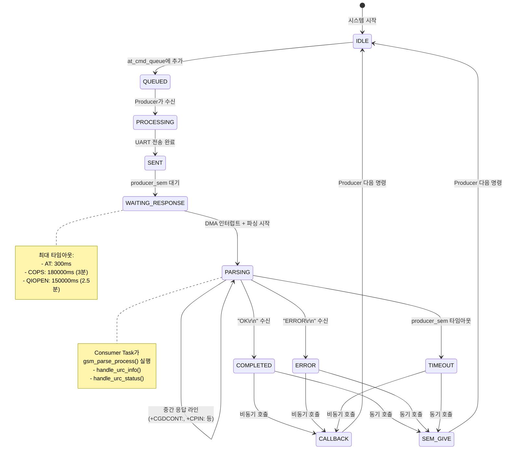
```mermaid
stateDiagram-v2
    [*] --> IDLE: 시스템 시작
    IDLE --> QUEUED: at_cmd_queue에 추가
    QUEUED --> PROCESSING: Producer가 수신
    PROCESSING --> SENT: UART 전송 완료
    SENT --> WAITING_RESPONSE: producer_sem 대기

    WAITING_RESPONSE --> PARSING: DMA 인터럽트 + 파싱 시작
    PARSING --> PARSING: 중간 응답 라인<br/>(+CGDCONT:, +CPIN: 등)
    PARSING --> COMPLETED: "OK\r\n" 수신
    PARSING --> ERROR: "ERROR\r\n" 수신
    PARSING --> TIMEOUT: producer_sem 타임아웃

    COMPLETED --> CALLBACK: 비동기 호출
    COMPLETED --> SEM_GIVE: 동기 호출
    ERROR --> CALLBACK: 비동기 호출
    ERROR --> SEM_GIVE: 동기 호출
    TIMEOUT --> CALLBACK: 비동기 호출
    TIMEOUT --> SEM_GIVE: 동기 호출

    CALLBACK --> IDLE: Producer 다음 명령
    SEM_GIVE --> IDLE: Producer 다음 명령

    note right of PARSING
        Consumer Task가
        gsm_parse_process() 실행
        - handle_urc_info()
        - handle_urc_status()
    end note

    note right of WAITING_RESPONSE
        최대 타임아웃:
        - AT: 300ms
        - COPS: 180000ms (3분)
        - QIOPEN: 150000ms (2.5분)
    end note
```

### URC 핸들러 테이블 구조

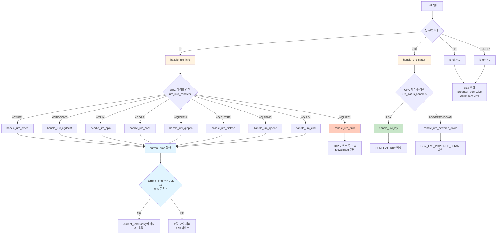
```mermaid
graph TD
    A[수신 라인] --> B{첫 문자 확인}
    B -->|'+'| C[handle_urc_info]
    B -->|기타| D[handle_urc_status]
    B -->|"OK"| E[is_ok = 1]
    B -->|"ERROR"| F[is_err = 1]

    C --> C1{URC 테이블 검색<br/>urc_info_handlers}
    C1 -->|"+CMEE: "| C2[handle_urc_cmee]
    C1 -->|"+CGDCONT: "| C3[handle_urc_cgdcont]
    C1 -->|"+CPIN: "| C4[handle_urc_cpin]
    C1 -->|"+COPS: "| C5[handle_urc_cops]
    C1 -->|"+QIOPEN: "| C6[handle_urc_qiopen]
    C1 -->|"+QICLOSE: "| C7[handle_urc_qiclose]
    C1 -->|"+QISEND: "| C8[handle_urc_qisend]
    C1 -->|"+QIRD: "| C9[handle_urc_qird]
    C1 -->|"+QIURC: "| C10[handle_urc_qiurc]

    D --> D1{URC 테이블 검색<br/>urc_status_handlers}
    D1 -->|"RDY"| D2[handle_urc_rdy]
    D1 -->|"POWERED DOWN"| D3[handle_urc_powered_down]

    C2 --> G[current_cmd 확인]
    C3 --> G
    C4 --> G
    C5 --> G
    C6 --> G
    C7 --> G
    C8 --> G
    C9 --> G

    G --> H{current_cmd != NULL<br/>&&<br/>cmd 일치?}
    H -->|Yes| I[current_cmd->msg에 저장<br/>AT 응답]
    H -->|No| J[로컬 변수 처리<br/>URC 이벤트]

    C10 --> K[TCP 이벤트 큐 전송<br/>recv/closed 알림]
    D2 --> L[GSM_EVT_RDY 발생]
    D3 --> M[GSM_EVT_POWERED_DOWN 발생]

    E --> N[msg 백업<br/>producer_sem Give<br/>Caller sem Give]
    F --> N

    style C fill:#fff3e0
    style D fill:#fff3e0
    style C10 fill:#ffccbc
    style D2 fill:#c8e6c9
    style G fill:#e1f5ff
    style H fill:#e1f5ff
```

---

## 4. TCP 통신 흐름

### TCP 연결 및 데이터 전송 시퀀스

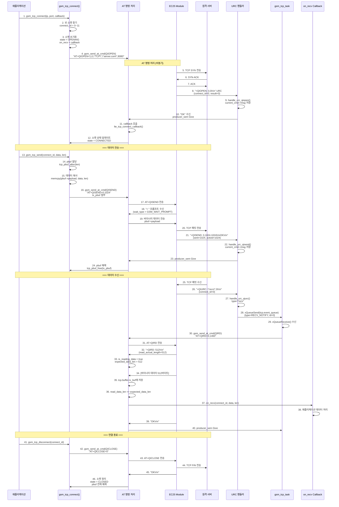
```mermaid
sequenceDiagram
    participant App as 애플리케이션
    participant API as gsm_tcp_connect()
    participant AT as AT 명령 처리
    participant EC25 as EC25 Module
    participant Server as 원격 서버
    participant URC as URC 핸들러
    participant TCPTask as gsm_tcp_task
    participant Callback as on_recv Callback

    App->>API: 1. gsm_tcp_connect(ip, port, callback)
    API->>API: 2. 빈 소켓 찾기<br/>connect_id = 0~11
    API->>API: 3. 소켓 초기화<br/>state = OPENING<br/>on_recv = callback
    API->>AT: 4. gsm_send_at_cmd(QIOPEN)<br/>"AT+QIOPEN=1,0,\"TCP\",\"server.com\",8080"

    Note over AT,EC25: AT 명령 처리 (비동기)

    EC25->>Server: 5. TCP SYN 전송
    Server->>EC25: 6. SYN-ACK
    EC25->>Server: 7. ACK

    EC25->>URC: 8. "+QIOPEN: 0,0\r\n" URC<br/>(connect_id=0, result=0)
    URC->>URC: 9. handle_urc_qiopen()<br/>current_cmd->msg 저장
    URC->>AT: 10. "OK" 수신<br/>producer_sem Give
    AT->>AT: 11. callback 호출<br/>lte_tcp_connect_callback()
    AT->>API: 12. 소켓 상태 업데이트<br/>state = CONNECTED

    Note over App,Server: === 데이터 전송 ===

    App->>API: 13. gsm_tcp_send(connect_id, data, len)
    API->>API: 14. pbuf 할당<br/>tcp_pbuf_alloc(len)
    API->>API: 15. 데이터 복사<br/>memcpy(pbuf->payload, data, len)
    API->>AT: 16. gsm_send_at_cmd(QISEND)<br/>"AT+QISEND=0,1024"<br/>tx_pbuf 첨부

    AT->>EC25: 17. AT+QISEND 전송
    EC25->>AT: 18. "> " 프롬프트 수신<br/>(wait_type = GSM_WAIT_PROMPT)
    AT->>EC25: 19. 바이너리 데이터 전송<br/>pbuf->payload

    EC25->>Server: 20. TCP 패킷 전송
    EC25->>URC: 21. "+QISEND: 0,1024,1024\r\nOK\r\n"<br/>(sent=1024, acked=1024)
    URC->>URC: 22. handle_urc_qisend()<br/>current_cmd->msg 저장
    URC->>AT: 23. producer_sem Give
    AT->>API: 24. pbuf 해제<br/>tcp_pbuf_free(tx_pbuf)

    Note over App,Server: === 데이터 수신 ===

    Server->>EC25: 25. TCP 패킷 수신
    EC25->>URC: 26. "+QIURC: \"recv\",0\r\n"<br/>(connect_id=0)
    URC->>URC: 27. handle_urc_qiurc()<br/>type="recv"
    URC->>TCPTask: 28. xQueueSend(tcp.event_queue)<br/>{type=RECV_NOTIFY, id=0}

    TCPTask->>TCPTask: 29. xQueueReceive() 수신
    TCPTask->>AT: 30. gsm_send_at_cmd(QIRD)<br/>"AT+QIRD=0,1460"

    AT->>EC25: 31. AT+QIRD 전송
    EC25->>AT: 32. "+QIRD: 512\r\n"<br/>(read_actual_length=512)
    AT->>AT: 33. is_reading_data = true<br/>expected_data_len = 512
    EC25->>AT: 34. [바이너리 데이터 512바이트]
    AT->>AT: 35. tcp.buffer.rx_buf에 저장
    AT->>AT: 36. read_data_len == expected_data_len
    AT->>Callback: 37. on_recv(connect_id, data, len)
    Callback->>Callback: 38. 애플리케이션 데이터 처리

    EC25->>AT: 39. "OK\r\n"
    AT->>TCPTask: 40. producer_sem Give

    Note over App,Server: === 연결 종료 ===

    App->>API: 41. gsm_tcp_disconnect(connect_id)
    API->>AT: 42. gsm_send_at_cmd(QICLOSE)<br/>"AT+QICLOSE=0"
    AT->>EC25: 43. AT+QICLOSE 전송
    EC25->>Server: 44. TCP FIN 전송
    EC25->>AT: 45. "OK\r\n"
    AT->>API: 46. 소켓 정리<br/>state = CLOSED<br/>pbuf 전체 해제
```

### TCP 소켓 상태 머신

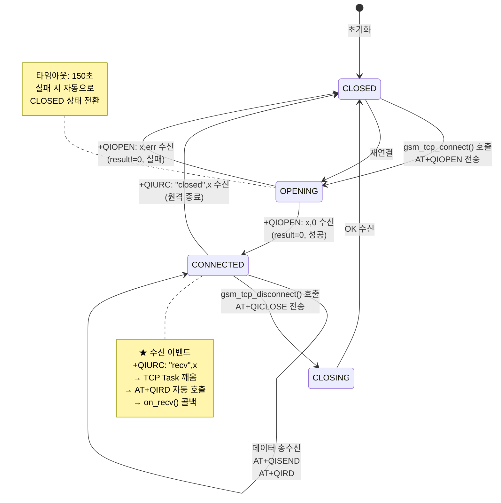
```mermaid
stateDiagram-v2
    [*] --> CLOSED: 초기화
    CLOSED --> OPENING: gsm_tcp_connect() 호출<br/>AT+QIOPEN 전송
    OPENING --> CONNECTED: +QIOPEN: x,0 수신<br/>(result=0, 성공)
    OPENING --> CLOSED: +QIOPEN: x,err 수신<br/>(result!=0, 실패)

    CONNECTED --> CONNECTED: 데이터 송수신<br/>AT+QISEND<br/>AT+QIRD

    CONNECTED --> CLOSING: gsm_tcp_disconnect() 호출<br/>AT+QICLOSE 전송
    CONNECTED --> CLOSED: +QIURC: "closed",x 수신<br/>(원격 종료)

    CLOSING --> CLOSED: OK 수신

    CLOSED --> OPENING: 재연결

    note right of CONNECTED
        ★ 수신 이벤트
        +QIURC: "recv",x
        → TCP Task 깨움
        → AT+QIRD 자동 호출
        → on_recv() 콜백
    end note

    note left of OPENING
        타임아웃: 150초
        실패 시 자동으로
        CLOSED 상태 전환
    end note
```

### TCP 버퍼 관리 (pbuf 체인)

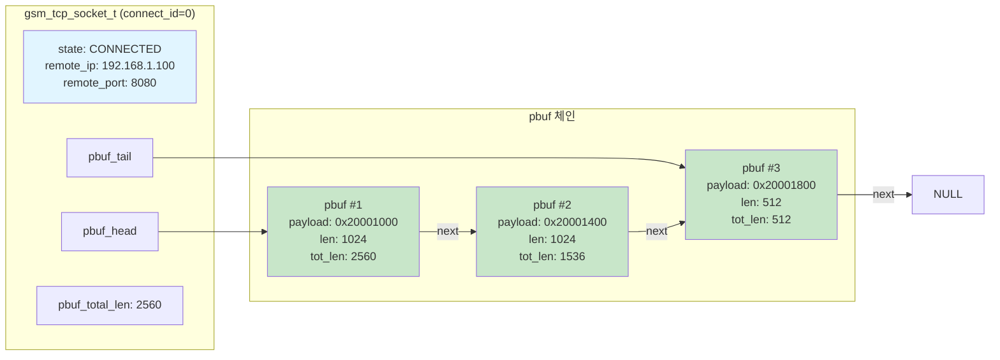
```mermaid
graph LR
    subgraph "gsm_tcp_socket_t (connect_id=0)"
        S[state: CONNECTED<br/>remote_ip: 192.168.1.100<br/>remote_port: 8080]
        HEAD[pbuf_head]
        TAIL[pbuf_tail]
        LEN[pbuf_total_len: 2560]
    end

    subgraph "pbuf 체인"
        P1[pbuf #1<br/>payload: 0x20001000<br/>len: 1024<br/>tot_len: 2560]
        P2[pbuf #2<br/>payload: 0x20001400<br/>len: 1024<br/>tot_len: 1536]
        P3[pbuf #3<br/>payload: 0x20001800<br/>len: 512<br/>tot_len: 512]
    end

    HEAD --> P1
    TAIL --> P3
    P1 -->|next| P2
    P2 -->|next| P3
    P3 -->|next| NULL[NULL]

    style P1 fill:#c8e6c9
    style P2 fill:#c8e6c9
    style P3 fill:#c8e6c9
    style S fill:#e1f5ff
```

**pbuf 동작**:
1. **할당**: `tcp_pbuf_alloc(len)` → malloc(sizeof(tcp_pbuf_t)) + malloc(len)
2. **연결**: `tcp_pbuf_cat(head, new)` → 체인 끝에 추가
3. **읽기**: `tcp_pbuf_copy_partial(pbuf, dst, len, offset)` → 체인 순회하며 복사
4. **해제**: `tcp_pbuf_free(pbuf)` → 재귀적으로 next 해제

---

## 5. LTE 초기화 상태 머신

### LTE 초기화 전체 흐름

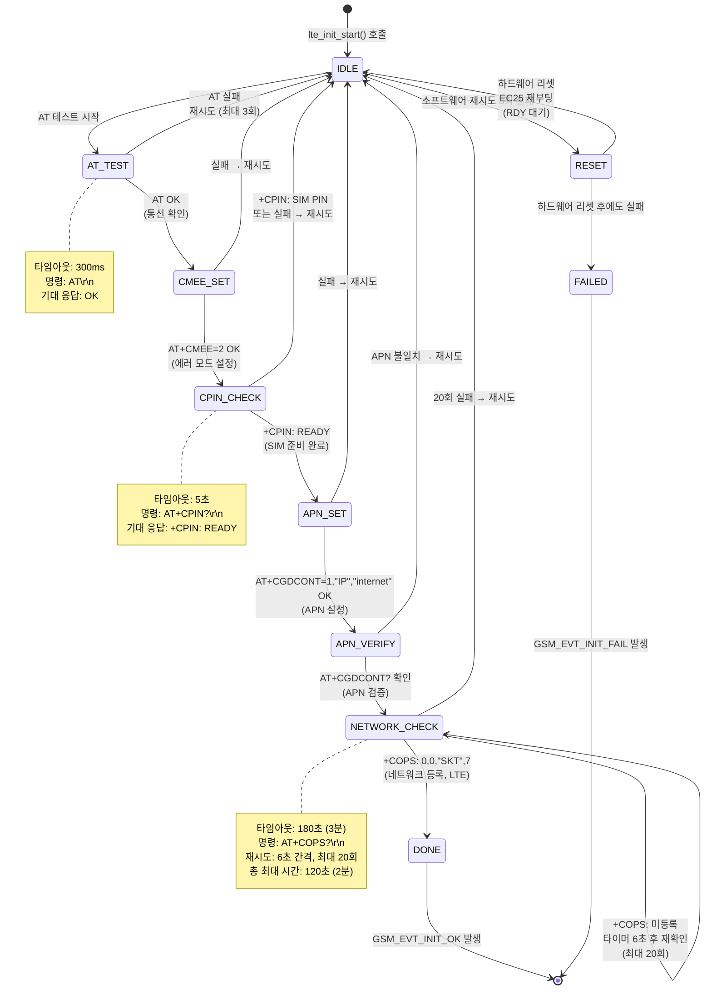
```mermaid
stateDiagram-v2
    [*] --> IDLE: lte_init_start() 호출

    IDLE --> AT_TEST: AT 테스트 시작
    AT_TEST --> CMEE_SET: AT OK<br/>(통신 확인)
    AT_TEST --> IDLE: AT 실패<br/>재시도 (최대 3회)

    CMEE_SET --> CPIN_CHECK: AT+CMEE=2 OK<br/>(에러 모드 설정)
    CMEE_SET --> IDLE: 실패 → 재시도

    CPIN_CHECK --> APN_SET: +CPIN: READY<br/>(SIM 준비 완료)
    CPIN_CHECK --> IDLE: +CPIN: SIM PIN<br/>또는 실패 → 재시도

    APN_SET --> APN_VERIFY: AT+CGDCONT=1,"IP","internet" OK<br/>(APN 설정)
    APN_SET --> IDLE: 실패 → 재시도

    APN_VERIFY --> NETWORK_CHECK: AT+CGDCONT? 확인<br/>(APN 검증)
    APN_VERIFY --> IDLE: APN 불일치 → 재시도

    NETWORK_CHECK --> DONE: +COPS: 0,0,"SKT",7<br/>(네트워크 등록, LTE)
    NETWORK_CHECK --> NETWORK_CHECK: +COPS: 미등록<br/>타이머 6초 후 재확인<br/>(최대 20회)
    NETWORK_CHECK --> IDLE: 20회 실패 → 재시도

    IDLE --> RESET: 소프트웨어 재시도 3회 실패
    RESET --> IDLE: 하드웨어 리셋<br/>EC25 재부팅<br/>(RDY 대기)

    RESET --> FAILED: 하드웨어 리셋 후에도 실패

    DONE --> [*]: GSM_EVT_INIT_OK 발생
    FAILED --> [*]: GSM_EVT_INIT_FAIL 발생

    note right of AT_TEST
        타임아웃: 300ms
        명령: AT\r\n
        기대 응답: OK
    end note

    note right of CPIN_CHECK
        타임아웃: 5초
        명령: AT+CPIN?\r\n
        기대 응답: +CPIN: READY
    end note

    note right of NETWORK_CHECK
        타임아웃: 180초 (3분)
        명령: AT+COPS?\r\n
        재시도: 6초 간격, 최대 20회
        총 최대 시간: 120초 (2분)
    end note
```

### LTE 초기화 타이밍 다이어그램

```mermaid
gantt
    title LTE 초기화 타임라인 (성공 시나리오)
    dateFormat X
    axisFormat %L ms

    section EC25 부팅
    전원 ON 시퀀스        :0, 1300
    EC25 부팅             :1300, 14300
    RDY URC 수신          :14300, 14305

    section 1단계: AT 테스트
    AT 명령 전송          :14305, 14310
    응답 대기             :14310, 14610
    OK 수신               :14610, 14615

    section 2단계: CMEE 설정
    AT+CMEE=2 전송        :14615, 14620
    응답 대기             :14620, 14920
    OK 수신               :14920, 14925

    section 3단계: CPIN 확인
    AT+CPIN? 전송         :14925, 14930
    SIM 초기화 대기       :14930, 19930
    +CPIN: READY 수신     :19930, 19935

    section 4단계: APN 설정
    AT+CGDCONT=1 전송     :19935, 19940
    응답 대기             :19940, 20240
    OK 수신               :20240, 20245

    section 5단계: APN 확인
    AT+CGDCONT? 전송      :20245, 20250
    응답 대기             :20250, 20550
    +CGDCONT: 1 수신      :20550, 20555

    section 6단계: 네트워크
    AT+COPS? 전송 (1회)   :20555, 20560
    네트워크 스캔         :20560, 200560
    +COPS: 미등록         :200560, 200565
    타이머 대기 6초       :200565, 206565
    AT+COPS? 전송 (2회)   :206565, 206570
    네트워크 스캔         :206570, 386570
    +COPS: 0,0,"SKT",7    :386570, 386575
    초기화 완료           :386575, 386580
```

### 네트워크 체크 메커니즘

```mermaid
graph TD
    A[네트워크 체크 시작] --> B[AT+COPS? 전송]
    B --> C{응답 수신}

    C -->|+COPS: 0,0,"SKT",7| D[등록 성공<br/>act=7 LTE]
    C -->|+COPS: 0| E[미등록]
    C -->|타임아웃/에러| E

    D --> F[타이머 중지]
    F --> G[lte_init_state = DONE]
    G --> H[GSM_EVT_INIT_OK 발생]
    H --> I[애플리케이션 시작]

    E --> J{재시도 횟수<br/>< 20?}
    J -->|Yes| K[타이머 시작<br/>6초 후 재시도]
    K --> B

    J -->|No| L[최대 재시도 초과]
    L --> M{소프트웨어<br/>재시도 < 3?}
    M -->|Yes| N[lte_init_start()<br/>처음부터 다시]
    M -->|No| O{하드웨어<br/>리셋 시도?}
    O -->|Yes| P[gsm_port_reset()<br/>EC25 재부팅]
    P --> Q[RDY 대기 후<br/>lte_init_start]
    O -->|No| R[lte_init_state = FAILED]
    R --> S[GSM_EVT_INIT_FAIL 발생]

    style D fill:#c8e6c9
    style H fill:#c8e6c9
    style I fill:#c8e6c9
    style R fill:#ffcdd2
    style S fill:#ffcdd2
```

---

## 6. DMA 순환 버퍼 동작

### DMA 순환 버퍼 메커니즘

```mermaid
graph TD
    subgraph "하드웨어 레벨"
        UART[USART1 DR<br/>Data Register] -->|바이트 단위| DMA[DMA2 Stream 2<br/>Controller]
    end

    subgraph "메모리 (순환 버퍼)"
        direction LR
        BUF[gsm_mem[2048]<br/>순환 버퍼]
        BUF --> B0[0]
        B0 --> B1[...]
        B1 --> B1023[1023]
        B1023 --> B1024[1024<br/>★ Half-Transfer]
        B1024 --> B1025[...]
        B1025 --> B2047[2047]
        B2047 -.래핑.-> B0
    end

    DMA -->|자동 기록| BUF

    subgraph "인터럽트"
        IRQ1[DMA HT<br/>Half-Transfer<br/>pos=1024]
        IRQ2[DMA TC<br/>Transfer Complete<br/>pos=0 래핑]
        IRQ3[UART IDLE<br/>유휴 감지<br/>임의 pos]
    end

    DMA -.트리거.-> IRQ1
    DMA -.트리거.-> IRQ2
    UART -.트리거.-> IRQ3

    subgraph "소프트웨어 처리"
        IRQ1 --> QUEUE[gsm_queue에<br/>이벤트 전송]
        IRQ2 --> QUEUE
        IRQ3 --> QUEUE
        QUEUE --> TASK[gsm_process_task<br/>깨어남]
        TASK --> POS[현재 DMA 위치 조회<br/>pos = 2048 - DMA_GetDataLength]
        POS --> PARSE{old_pos vs pos}
        PARSE -->|old_pos < pos| LINEAR[선형 파싱<br/>gsm_mem[old_pos ~ pos]]
        PARSE -->|old_pos > pos| WRAP[래핑 파싱<br/>1 gsm_mem[old_pos ~ 2047]<br/>2 gsm_mem[0 ~ pos]]
        LINEAR --> UPDATE[old_pos = pos]
        WRAP --> UPDATE
    end

    style UART fill:#ffebee
    style DMA fill:#ffebee
    style BUF fill:#e1f5ff
    style QUEUE fill:#fff3e0
    style TASK fill:#c8e6c9
```

### DMA 버퍼 파싱 예제

```
시나리오: EC25에서 "AT\r\n+CPIN: READY\r\nOK\r\n" 수신

초기 상태:
- old_pos = 0
- DMA가 데이터 수신 시작

[단계 1] DMA 수신 (바이트 단위)
gsm_mem[0]   = 'A'
gsm_mem[1]   = 'T'
gsm_mem[2]   = '\r'
gsm_mem[3]   = '\n'
...
gsm_mem[19]  = '\n'

[단계 2] UART IDLE 인터럽트
- DMA 위치: pos = 20
- IRQ: xQueueSend(gsm_queue)

[단계 3] gsm_process_task 깨어남
- old_pos = 0, pos = 20
- 파싱: gsm_mem[0:20]
  - 라인 1: "AT\r\n" → 버퍼에 추가 (아직 OK 안 옴)
  - 라인 2: "+CPIN: READY\r\n" → handle_urc_cpin()
  - 라인 3: "OK\r\n" → is_ok = 1, producer_sem Give
- old_pos = 20

[단계 4] 순환 시나리오
- 추가 데이터 수신으로 버퍼가 가득 참
- pos = 2047 → 0으로 래핑
- old_pos = 2000, pos = 100
- 파싱:
  1. gsm_mem[2000:2048] 먼저 파싱
  2. gsm_mem[0:100] 이어서 파싱
```

### DMA 순환 버퍼 시각화

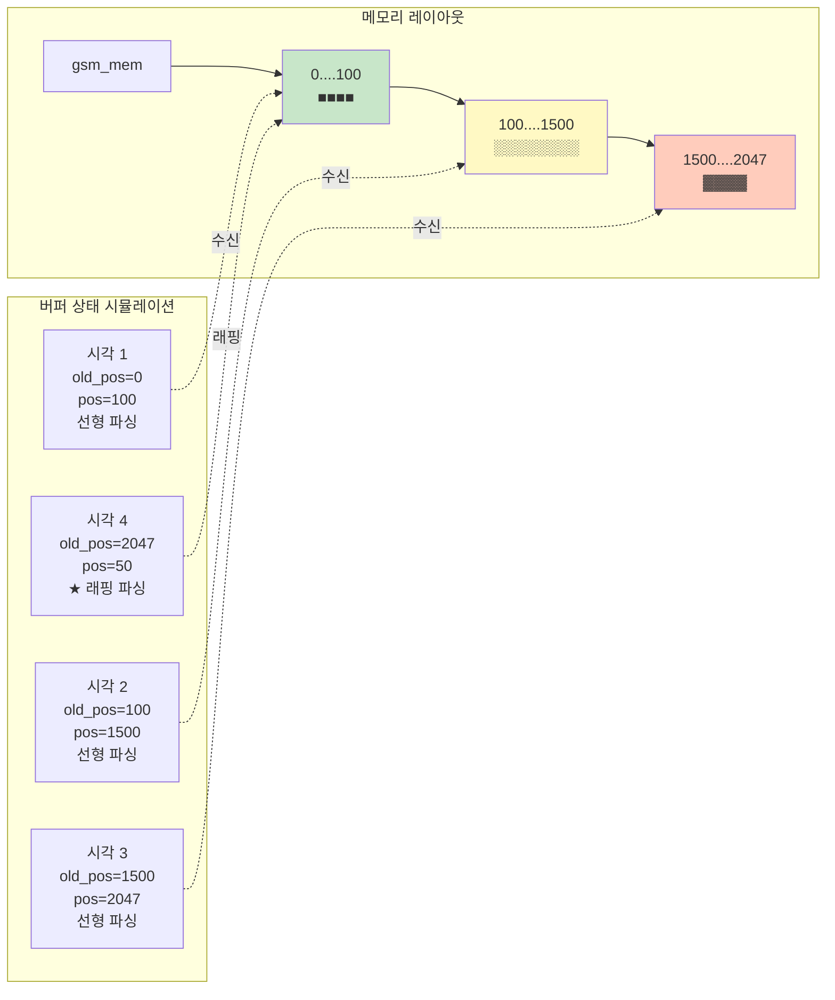
```mermaid
graph LR
    subgraph "버퍼 상태 시뮬레이션"
        direction TB
        T1[시각 1<br/>old_pos=0<br/>pos=100<br/>선형 파싱]
        T2[시각 2<br/>old_pos=100<br/>pos=1500<br/>선형 파싱]
        T3[시각 3<br/>old_pos=1500<br/>pos=2047<br/>선형 파싱]
        T4[시각 4<br/>old_pos=2047<br/>pos=50<br/>★ 래핑 파싱]
    end

    subgraph "메모리 레이아웃"
        direction LR
        M[gsm_mem]
        M --> R1[0....100<br/>■■■■]
        R1 --> R2[100....1500<br/>░░░░░░░░]
        R2 --> R3[1500....2047<br/>▓▓▓▓]
    end

    T1 -.수신.-> R1
    T2 -.수신.-> R2
    T3 -.수신.-> R3
    T4 -.래핑.-> R1

    style R1 fill:#c8e6c9
    style R2 fill:#fff9c4
    style R3 fill:#ffccbc
```

---

## 7. Producer-Consumer 패턴

### 전체 아키텍처

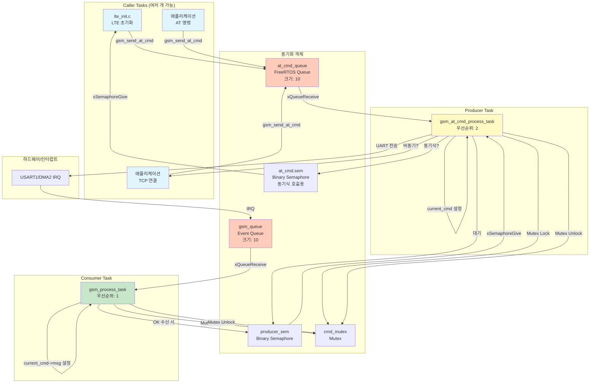
```mermaid
graph TD
    subgraph "Caller Tasks (여러 개 가능)"
        C1[lte_init.c<br/>LTE 초기화]
        C2[애플리케이션<br/>TCP 연결]
        C3[애플리케이션<br/>AT 명령]
    end

    subgraph "동기화 객체"
        Q1[at_cmd_queue<br/>FreeRTOS Queue<br/>크기: 10]
        Q2[gsm_queue<br/>Event Queue<br/>크기: 10]
        S1[producer_sem<br/>Binary Semaphore]
        S2[cmd_mutex<br/>Mutex]
        S3[at_cmd.sem<br/>Binary Semaphore<br/>동기식 호출용]
    end

    subgraph "Producer Task"
        P[gsm_at_cmd_process_task<br/>우선순위: 2]
    end

    subgraph "Consumer Task"
        CON[gsm_process_task<br/>우선순위: 1]
    end

    subgraph "하드웨어/인터럽트"
        UART[USART1/DMA2 IRQ]
    end

    C1 -->|gsm_send_at_cmd| Q1
    C2 -->|gsm_send_at_cmd| Q1
    C3 -->|gsm_send_at_cmd| Q1

    Q1 -->|xQueueReceive| P
    P -->|Mutex Lock| S2
    P -->|current_cmd 설정| P
    P -->|UART 전송| UART
    P -->|Mutex Unlock| S2
    P -->|대기| S1

    UART -->|IRQ| Q2
    Q2 -->|xQueueReceive| CON
    CON -->|DMA 버퍼 파싱| CON
    CON -->|Mutex Lock| S2
    CON -->|current_cmd->msg 설정| CON
    CON -->|Mutex Unlock| S2
    CON -->|OK 수신 시| S1

    S1 -->|xSemaphoreGive| P
    P -->|동기식?| S3
    S3 -->|xSemaphoreGive| C1

    P -->|비동기?| C2

    style C1 fill:#e1f5ff
    style C2 fill:#e1f5ff
    style C3 fill:#e1f5ff
    style P fill:#fff9c4
    style CON fill:#c8e6c9
    style Q1 fill:#ffccbc
    style Q2 fill:#ffccbc
```

### 동기식 vs 비동기식 호출

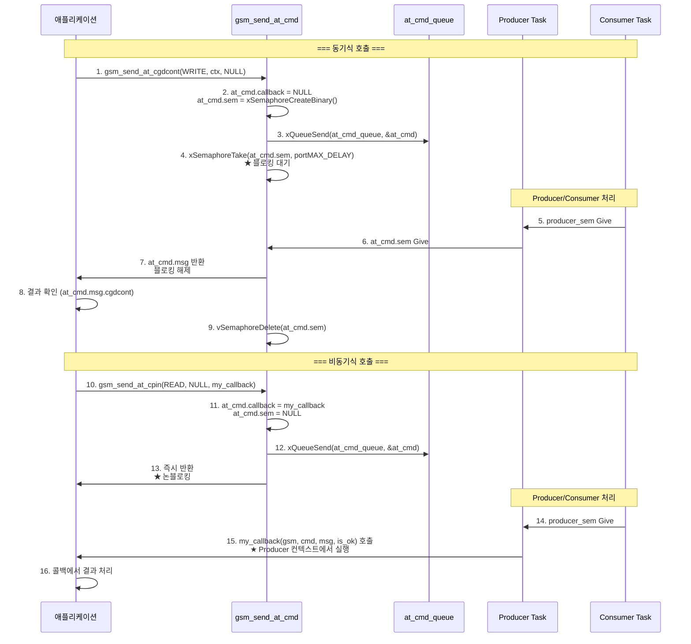
```mermaid
sequenceDiagram
    participant App as 애플리케이션
    participant API as gsm_send_at_cmd
    participant Queue as at_cmd_queue
    participant Producer as Producer Task
    participant Consumer as Consumer Task

    Note over App,Consumer: === 동기식 호출 ===
    App->>API: 1. gsm_send_at_cgdcont(WRITE, ctx, NULL)
    API->>API: 2. at_cmd.callback = NULL<br/>at_cmd.sem = xSemaphoreCreateBinary()
    API->>Queue: 3. xQueueSend(at_cmd_queue, &at_cmd)
    API->>API: 4. xSemaphoreTake(at_cmd.sem, portMAX_DELAY)<br/>★ 블로킹 대기

    Note over Producer,Consumer: Producer/Consumer 처리

    Consumer->>Producer: 5. producer_sem Give
    Producer->>API: 6. at_cmd.sem Give
    API->>App: 7. at_cmd.msg 반환<br/>블로킹 해제
    App->>App: 8. 결과 확인 (at_cmd.msg.cgdcont)
    API->>API: 9. vSemaphoreDelete(at_cmd.sem)

    Note over App,Consumer: === 비동기식 호출 ===
    App->>API: 10. gsm_send_at_cpin(READ, NULL, my_callback)
    API->>API: 11. at_cmd.callback = my_callback<br/>at_cmd.sem = NULL
    API->>Queue: 12. xQueueSend(at_cmd_queue, &at_cmd)
    API->>App: 13. 즉시 반환<br/>★ 논블로킹

    Note over Producer,Consumer: Producer/Consumer 처리

    Consumer->>Producer: 14. producer_sem Give
    Producer->>App: 15. my_callback(gsm, cmd, msg, is_ok) 호출<br/>★ Producer 컨텍스트에서 실행
    App->>App: 16. 콜백에서 결과 처리
```

### 메모리 안전성 설계

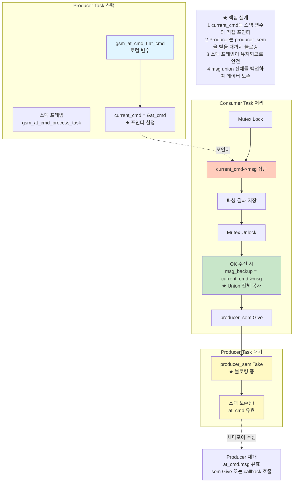
```mermaid
graph TD
    subgraph "Producer Task 스택"
        direction TB
        STACK1[스택 프레임<br/>gsm_at_cmd_process_task]
        STACK2[gsm_at_cmd_t at_cmd<br/>로컬 변수]
        STACK3[current_cmd = &at_cmd<br/>★ 포인터 설정]
    end

    subgraph "Consumer Task 처리"
        direction TB
        C1[Mutex Lock]
        C2[current_cmd->msg 접근]
        C3[파싱 결과 저장]
        C4[Mutex Unlock]
        C5[OK 수신 시<br/>msg_backup = current_cmd->msg<br/>★ Union 전체 복사]
        C6[producer_sem Give]
    end

    subgraph "Producer Task 대기"
        P1[producer_sem Take<br/>★ 블로킹 중]
        P2[스택 보존됨!<br/>at_cmd 유효]
    end

    STACK2 --> STACK3
    STACK3 -.포인터.-> C2
    C1 --> C2
    C2 --> C3
    C3 --> C4
    C4 --> C5
    C5 --> C6
    C6 --> P1
    P1 --> P2

    P2 -.세마포어 수신.-> RESUME[Producer 재개<br/>at_cmd.msg 유효<br/>sem Give 또는 callback 호출]

    style STACK2 fill:#e1f5ff
    style C2 fill:#ffccbc
    style C5 fill:#c8e6c9
    style P1 fill:#fff9c4
    style P2 fill:#fff9c4

    note1[★ 핵심 설계<br/>1 current_cmd는 스택 변수의 직접 포인터<br/>2 Producer는 producer_sem을 받을 때까지 블로킹<br/>3 스택 프레임이 유지되므로 안전<br/>4 msg union 전체를 백업하여 데이터 보존]
```

---

## 8. 인터럽트 및 동기화

### 인터럽트 우선순위 맵

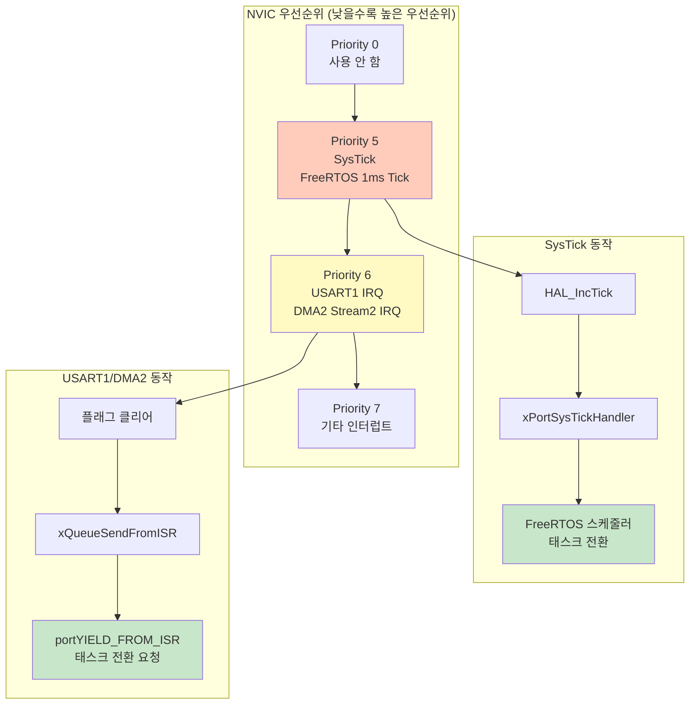
```mermaid
graph TD
    subgraph "NVIC 우선순위 (낮을수록 높은 우선순위)"
        P0[Priority 0<br/>사용 안 함]
        P5[Priority 5<br/>SysTick<br/>FreeRTOS 1ms Tick]
        P6[Priority 6<br/>USART1 IRQ<br/>DMA2 Stream2 IRQ]
        P7[Priority 7<br/>기타 인터럽트]
    end

    P0 --> P5
    P5 --> P6
    P6 --> P7

    subgraph "SysTick 동작"
        ST1[HAL_IncTick]
        ST2[xPortSysTickHandler]
        ST3[FreeRTOS 스케줄러<br/>태스크 전환]
    end

    P5 --> ST1
    ST1 --> ST2
    ST2 --> ST3

    subgraph "USART1/DMA2 동작"
        U1[플래그 클리어]
        U2[xQueueSendFromISR]
        U3[portYIELD_FROM_ISR<br/>태스크 전환 요청]
    end

    P6 --> U1
    U1 --> U2
    U2 --> U3

    style P5 fill:#ffccbc
    style P6 fill:#fff9c4
    style ST3 fill:#c8e6c9
    style U3 fill:#c8e6c9
```

### FreeRTOS 동기화 객체 사용

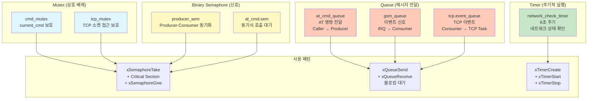
```mermaid
graph TD
    subgraph "Mutex (상호 배제)"
        M1[cmd_mutex<br/>current_cmd 보호]
        M2[tcp_mutex<br/>TCP 소켓 접근 보호]
    end

    subgraph "Binary Semaphore (신호)"
        S1[producer_sem<br/>Producer-Consumer 동기화]
        S2[at_cmd.sem<br/>동기식 호출 대기]
    end

    subgraph "Queue (메시지 전달)"
        Q1[at_cmd_queue<br/>AT 명령 전달<br/>Caller → Producer]
        Q2[gsm_queue<br/>이벤트 신호<br/>IRQ → Consumer]
        Q3[tcp.event_queue<br/>TCP 이벤트<br/>Consumer → TCP Task]
    end

    subgraph "Timer (주기적 실행)"
        T1[network_check_timer<br/>6초 주기<br/>네트워크 상태 확인]
    end

    subgraph "사용 패턴"
        U1[xSemaphoreTake<br/>+ Critical Section<br/>+ xSemaphoreGive]
        U2[xQueueSend<br/>+ xQueueReceive<br/>블로킹 대기]
        U3[xTimerCreate<br/>+ xTimerStart<br/>+ xTimerStop]
    end

    M1 --> U1
    M2 --> U1
    S1 --> U1
    S2 --> U1
    Q1 --> U2
    Q2 --> U2
    Q3 --> U2
    T1 --> U3

    style M1 fill:#e1f5ff
    style M2 fill:#e1f5ff
    style S1 fill:#fff9c4
    style S2 fill:#fff9c4
    style Q1 fill:#ffccbc
    style Q2 fill:#ffccbc
    style Q3 fill:#ffccbc
    style T1 fill:#c8e6c9
```

### 크리티컬 섹션 보호 예제

```c
// ============================================
// 예제 1: current_cmd 접근 (cmd_mutex)
// ============================================
// Producer Task
if (xSemaphoreTake(gsm->cmd_mutex, portMAX_DELAY) == pdTRUE) {
    gsm->current_cmd = &at_cmd;  // 포인터 설정
    xSemaphoreGive(gsm->cmd_mutex);
}

// Consumer Task
if (xSemaphoreTake(gsm->cmd_mutex, portMAX_DELAY) == pdTRUE) {
    if (gsm->current_cmd != NULL) {
        gsm->current_cmd->msg.cgdcont = parsed_data;  // 파싱 결과 저장
    }
    xSemaphoreGive(gsm->cmd_mutex);
}

// ============================================
// 예제 2: TCP 소켓 접근 (tcp_mutex)
// ============================================
int gsm_tcp_connect(gsm_t *gsm, const char *ip, uint16_t port) {
    if (xSemaphoreTake(gsm->tcp.tcp_mutex, pdMS_TO_TICKS(100)) == pdTRUE) {
        // 빈 소켓 찾기
        for (int i = 0; i < GSM_TCP_MAX_SOCKETS; i++) {
            if (gsm->tcp.sockets[i].state == GSM_TCP_STATE_CLOSED) {
                gsm->tcp.sockets[i].state = GSM_TCP_STATE_OPENING;
                gsm->tcp.sockets[i].remote_port = port;
                strcpy(gsm->tcp.sockets[i].remote_ip, ip);
                connect_id = i;
                break;
            }
        }
        xSemaphoreGive(gsm->tcp.tcp_mutex);
    }
    return connect_id;
}

// ============================================
// 예제 3: Producer-Consumer 동기화 (producer_sem)
// ============================================
// Producer Task
ops->send(at_cmd_str, len);  // UART 전송
if (xSemaphoreTake(gsm->producer_sem, timeout_ticks) == pdTRUE) {
    // 응답 수신 완료
    if (gsm->status.is_ok) {
        // 성공 처리
    }
} else {
    // 타임아웃
}

// Consumer Task (OK 수신 시)
if (gsm->producer_sem) {
    xSemaphoreGive(gsm->producer_sem);  // Producer 깨우기
}

// ============================================
// 예제 4: 동기식 호출 대기 (at_cmd.sem)
// ============================================
// Caller Task
gsm_at_cmd_t at_cmd = {...};
at_cmd.sem = xSemaphoreCreateBinary();
xQueueSend(gsm->at_cmd_queue, &at_cmd, portMAX_DELAY);
xSemaphoreTake(at_cmd.sem, portMAX_DELAY);  // 응답 대기
// at_cmd.msg에 결과 확인
vSemaphoreDelete(at_cmd.sem);
```

---

## 9. 주요 데이터 구조

### gsm_t 구조체 (핵심)

```c
typedef struct gsm_s {
    // ========== 수신 데이터 ==========
    gsm_recv_t recv;  // {char data[128]; size_t len;}

    // ========== 상태 플래그 ==========
    gsm_status_t status;  // {
    //   uint8_t is_ok : 1;
    //   uint8_t is_err : 1;
    //   uint8_t is_timeout : 1;
    //   uint8_t is_powered : 1;
    //   uint8_t is_sim_rdy : 1;
    // }

    // ========== 이벤트 핸들러 ==========
    gsm_evt_handler_t evt_handler;  // {
    //   void (*handler)(gsm_evt_t evt, void *args);
    //   void *args;
    // }

    // ========== AT 명령 동기화 ==========
    gsm_at_cmd_t *current_cmd;      // ★ 처리 중인 AT 명령 (스택 포인터!)
    SemaphoreHandle_t cmd_mutex;    // current_cmd 접근 보호
    SemaphoreHandle_t producer_sem; // Producer-Consumer 동기화
    QueueHandle_t at_cmd_queue;     // AT 명령 큐 (크기: 10)

    // ========== HAL 인터페이스 ==========
    const gsm_hal_ops_t *ops;             // {init, reset, send, recv}
    const gsm_at_cmd_entry_t *at_tbl;     // AT 명령 테이블
    const urc_handler_entry_t *urc_stat_tbl;  // 상태 URC 핸들러
    const urc_handler_entry_t *urc_info_tbl;  // 정보 URC 핸들러

    // ========== TCP 관리 ==========
    gsm_tcp_t tcp;  // {
    //   gsm_tcp_socket_t sockets[12];
    //   gsm_tcp_buffer_t buffer;
    //   SemaphoreHandle_t tcp_mutex;
    //   QueueHandle_t event_queue;
    //   TaskHandle_t task_handle;
    // }
} gsm_t;
```

### gsm_at_cmd_t 구조체 (AT 명령)

```c
typedef struct {
    // ========== 명령 식별 ==========
    gsm_cmd_t cmd;  // GSM_CMD_AT, GSM_CMD_CGDCONT, GSM_CMD_QIOPEN 등

    // ========== 명령 파라미터 ==========
    char params[GSM_AT_CMD_PARAM_SIZE];  // 128바이트
    // 예: "1,\"IP\",\"internet\"" (CGDCONT)
    // 예: "1,0,\"TCP\",\"192.168.1.100\",8080" (QIOPEN)

    // ========== AT 모드 ==========
    gsm_at_mode_t at_mode;  // EXECUTE, WRITE, READ, TEST

    // ========== 응답 대기 타입 ==========
    gsm_wait_type_t wait_type;  // EXPECTED (일반), PROMPT (">")

    // ========== 콜백 (비동기) ==========
    at_cmd_handler callback;  // NULL이면 동기식
    // typedef void (*at_cmd_handler)(gsm_t *gsm, gsm_cmd_t cmd,
    //                                 void *msg, bool is_ok);

    // ========== 세마포어 (동기) ==========
    SemaphoreHandle_t sem;  // NULL이면 비동기식

    // ========== 타임아웃 ==========
    uint32_t timeout_ms;  // at_tbl에서 기본값 가져옴

    // ========== 파싱 결과 (Union) ==========
    gsm_msg_t msg;  // ★ 여러 AT 명령의 응답을 하나의 union으로 저장

    // ========== TCP 전송 데이터 ==========
    tcp_pbuf_t *tx_pbuf;  // QISEND용 (바이너리 데이터)
} gsm_at_cmd_t;
```

### gsm_msg_t 구조체 (Union)

```c
typedef union {
    // ========== AT+CGDCONT? (APN) ==========
    struct {
        gsm_pdp_context_t contexts[5];  // {
        //   uint8_t cid;              // Context ID (1~5)
        //   char type[16];            // "IP", "IPV6", "IPV4V6"
        //   char apn[100];            // "internet", "lte.sktelecom.com"
        //   char pdp_addr[64];
        //   uint8_t d_comp, h_comp;
        // }
        size_t count;
    } cgdcont;

    // ========== AT+COPS? (네트워크) ==========
    struct {
        uint8_t mode;     // 0=자동, 1=수동
        uint8_t format;   // 0=숫자, 2=문자열
        char oper[32];    // "SKT", "KT", "LGU+"
        uint8_t act;      // 7=LTE, 2=UTRAN, 0=GSM
    } cops;

    // ========== AT+CPIN? (SIM) ==========
    struct {
        char code[16];  // "READY", "SIM PIN", "SIM PUK"
    } cpin;

    // ========== AT+CMEE (에러 모드) ==========
    struct {
        gsm_cmee_mode_t mode;  // DISABLE, NUMERIC, VERBOSE
    } cmee;

    // ========== AT+QIOPEN (TCP 연결) ==========
    struct {
        uint8_t connect_id;  // 0~11
        int32_t result;      // 0=성공, 기타=에러 코드
    } qiopen;

    // ========== AT+QICLOSE (TCP 종료) ==========
    struct {
        uint8_t connect_id;
        int32_t result;
    } qiclose;

    // ========== AT+QISEND (TCP 전송) ==========
    struct {
        uint8_t connect_id;
        uint16_t sent_length;   // 전송된 바이트
        uint16_t acked_length;  // ACK된 바이트
    } qisend;

    // ========== AT+QIRD (TCP 수신) ==========
    struct {
        uint8_t connect_id;
        uint16_t read_actual_length;  // 실제 읽은 바이트
        uint8_t *data;                // tcp.buffer.rx_buf 포인터
    } qird;
} gsm_msg_t;
```

### gsm_tcp_socket_t 구조체 (TCP 소켓)

```c
typedef struct {
    // ========== 소켓 식별 ==========
    uint8_t connect_id;  // 0~11

    // ========== 연결 상태 ==========
    gsm_tcp_state_t state;  // CLOSED, OPENING, CONNECTED, CLOSING

    // ========== 원격 서버 정보 ==========
    char remote_ip[64];    // "192.168.1.100"
    uint16_t remote_port;  // 8080
    uint16_t local_port;   // 로컬 포트 (EC25 자동 할당)

    // ========== 수신 버퍼 (pbuf 체인) ==========
    tcp_pbuf_t *pbuf_head;  // 첫 번째 pbuf
    tcp_pbuf_t *pbuf_tail;  // 마지막 pbuf
    size_t pbuf_total_len;  // 전체 체인 길이

    // ========== 콜백 ==========
    tcp_recv_callback_t on_recv;    // 데이터 수신 시 호출
    tcp_close_callback_t on_close;  // 연결 종료 시 호출
} gsm_tcp_socket_t;

// 콜백 타입
typedef void (*tcp_recv_callback_t)(uint8_t connect_id,
                                     const uint8_t *data, size_t len);
typedef void (*tcp_close_callback_t)(uint8_t connect_id);
```

### tcp_pbuf_t 구조체 (TCP 버퍼)

```c
typedef struct tcp_pbuf_s {
    uint8_t *payload;    // 데이터 포인터 (malloc으로 할당)
    size_t len;          // 현재 pbuf의 데이터 길이
    size_t tot_len;      // 전체 체인 길이 (다음 pbuf 포함)
    struct tcp_pbuf_s *next;  // 다음 pbuf (NULL이면 끝)
} tcp_pbuf_t;

// ========== pbuf 함수들 ==========
// tcp_pbuf_alloc(size_t size)
//   → malloc(sizeof(tcp_pbuf_t)) + malloc(size)
//   → pbuf->payload = allocated_memory
//   → pbuf->len = size, pbuf->tot_len = size
//   → pbuf->next = NULL

// tcp_pbuf_cat(tcp_pbuf_t *head, tcp_pbuf_t *tail)
//   → head 체인의 끝에 tail 연결
//   → tot_len 업데이트

// tcp_pbuf_copy_partial(tcp_pbuf_t *pbuf, void *dst, size_t len, size_t offset)
//   → 체인을 순회하며 offset부터 len 바이트 복사

// tcp_pbuf_free(tcp_pbuf_t *pbuf)
//   → 재귀적으로 next 해제
//   → free(pbuf->payload), free(pbuf)
```

---

## 10. 코드 실행 흐름 상세

### 시나리오 1: 시스템 부팅 → LTE 초기화

```mermaid
sequenceDiagram
    participant Main as main()
    participant FreeRTOS as FreeRTOS Scheduler
    participant Init as initThread
    participant GSM as gsm_process_task
    participant LTE as lte_init
    participant EC25 as EC25 Module

    Main->>Main: 1. HAL_Init()<br/>SystemClock_Config()<br/>GPIO/DMA/UART 초기화
    Main->>FreeRTOS: 2. xTaskCreate(initThread)<br/>vTaskStartScheduler()
    Note over Main: ★ main() 반환 안 됨

    FreeRTOS->>Init: 3. initThread 시작
    Init->>GSM: 4. gsm_task_create()
    GSM->>GSM: 5. gsm_init()<br/>- at_cmd_queue 생성<br/>- producer_sem 생성<br/>- cmd_mutex 생성<br/>- TCP 초기화
    GSM->>GSM: 6. gsm_port_init()<br/>- USART1/DMA2 설정
    GSM->>GSM: 7. gsm_start()<br/>- DMA 시작<br/>- UART 인터럽트 활성화
    GSM->>EC25: 8. gsm_port_gpio_start()<br/>- EC25 전원 ON 시퀀스
    EC25->>EC25: 9. 부팅... (~13초)

    Init->>Init: 10. vTaskDelete(NULL)<br/>★ initThread 종료

    EC25->>GSM: 11. "RDY\r\n" URC
    GSM->>GSM: 12. handle_urc_rdy()<br/>GSM_EVT_RDY 발생
    GSM->>LTE: 13. lte_init_start()

    LTE->>LTE: 14. [1/6] AT 테스트
    LTE->>EC25: AT\r\n
    EC25->>LTE: OK\r\n

    LTE->>LTE: 15. [2/6] CMEE 설정
    LTE->>EC25: AT+CMEE=2\r\n
    EC25->>LTE: OK\r\n

    LTE->>LTE: 16. [3/6] CPIN 확인
    LTE->>EC25: AT+CPIN?\r\n
    EC25->>LTE: +CPIN: READY\r\nOK\r\n

    LTE->>LTE: 17. [4/6] APN 설정
    LTE->>EC25: AT+CGDCONT=1,"IP","internet"\r\n
    EC25->>LTE: OK\r\n

    LTE->>LTE: 18. [5/6] APN 확인
    LTE->>EC25: AT+CGDCONT?\r\n
    EC25->>LTE: +CGDCONT: 1,"IP","internet"\r\nOK\r\n

    LTE->>LTE: 19. [6/6] 네트워크 체크
    LTE->>EC25: AT+COPS?\r\n
    EC25->>LTE: +COPS: 0,0,"SKT",7\r\nOK\r\n

    LTE->>GSM: 20. GSM_EVT_INIT_OK 발생
    GSM->>GSM: 21. LTE 초기화 완료!
```

### 시나리오 2: TCP 연결 및 데이터 송수신

```mermaid
sequenceDiagram
    participant App as 애플리케이션
    participant TCP_API as gsm_tcp_*()
    participant AT as AT 처리
    participant EC25 as EC25
    participant Server as 서버
    participant TCPTask as gsm_tcp_task

    App->>TCP_API: 1. gsm_tcp_connect("192.168.1.100", 8080, on_recv)
    TCP_API->>TCP_API: 2. 빈 소켓 찾기 (connect_id=0)
    TCP_API->>TCP_API: 3. state = OPENING<br/>on_recv = callback
    TCP_API->>AT: 4. AT+QIOPEN=1,0,"TCP","192.168.1.100",8080

    Note over AT,EC25: AT 명령 처리 (~3초)

    EC25->>Server: 5. TCP 3-way handshake
    Server->>EC25: 6. 연결 완료
    EC25->>AT: 7. +QIOPEN: 0,0\r\nOK\r\n
    AT->>TCP_API: 8. state = CONNECTED

    Note over App,Server: === 데이터 전송 ===

    App->>TCP_API: 9. gsm_tcp_send(0, "GET / HTTP/1.1\r\n", 16)
    TCP_API->>TCP_API: 10. pbuf = tcp_pbuf_alloc(16)<br/>memcpy(pbuf->payload, data, 16)
    TCP_API->>AT: 11. AT+QISEND=0,16<br/>tx_pbuf 첨부

    AT->>EC25: 12. AT+QISEND=0,16\r\n
    EC25->>AT: 13. > (프롬프트)
    AT->>EC25: 14. [바이너리 데이터 16바이트]
    EC25->>Server: 15. TCP 패킷 전송
    EC25->>AT: 16. +QISEND: 0,16,16\r\nOK\r\n
    AT->>TCP_API: 17. tcp_pbuf_free(tx_pbuf)

    Note over App,Server: === 데이터 수신 ===

    Server->>EC25: 18. HTTP 응답 (512바이트)
    EC25->>AT: 19. +QIURC: "recv",0\r\n
    AT->>TCPTask: 20. TCP 이벤트 큐<br/>{type=RECV_NOTIFY, id=0}

    TCPTask->>AT: 21. AT+QIRD=0,1460\r\n
    AT->>EC25: 22. AT+QIRD=0,1460\r\n
    EC25->>AT: 23. +QIRD: 512\r\n<br/>[바이너리 데이터 512바이트]<br/>OK\r\n

    AT->>AT: 24. tcp.buffer.rx_buf에 저장
    AT->>App: 25. on_recv(0, rx_buf, 512) 콜백
    App->>App: 26. HTTP 응답 처리

    Note over App,Server: === 연결 종료 ===

    App->>TCP_API: 27. gsm_tcp_disconnect(0)
    TCP_API->>AT: 28. AT+QICLOSE=0\r\n
    AT->>EC25: 29. AT+QICLOSE=0\r\n
    EC25->>Server: 30. TCP FIN
    EC25->>AT: 31. OK\r\n
    AT->>TCP_API: 32. state = CLOSED<br/>pbuf_head 전체 해제
```

### 시나리오 3: DMA 순환 버퍼 파싱

```mermaid
sequenceDiagram
    participant EC25 as EC25 Module
    participant UART as USART1 DR
    participant DMA as DMA2 Stream2
    participant Mem as gsm_mem[2048]
    participant IRQ as USART1_IRQHandler
    participant Queue as gsm_queue
    participant Task as gsm_process_task
    participant Parser as gsm_parse_process()

    EC25->>UART: 1. "+CPIN: READY\r\nOK\r\n" 전송
    UART->>DMA: 2. DR 레지스터 읽기 트리거
    DMA->>Mem: 3. 바이트 단위 자동 전송<br/>pos 자동 증가

    Note over DMA,Mem: DMA 순환 버퍼<br/>pos: 0 → 1 → 2 → ... → 2047 → 0

    DMA->>IRQ: 4. UART IDLE 인터럽트<br/>또는 DMA HT/TC 인터럽트
    IRQ->>IRQ: 5. 플래그 클리어
    IRQ->>Queue: 6. xQueueSendFromISR(gsm_queue, dummy)
    IRQ->>IRQ: 7. portYIELD_FROM_ISR

    Queue->>Task: 8. xQueueReceive() 깨어남
    Task->>Task: 9. 현재 DMA 위치 계산<br/>pos = 2048 - DMA_GetDataLength()
    Task->>Task: 10. old_pos vs pos 비교

    alt old_pos < pos (선형)
        Task->>Parser: 11a. gsm_parse_process(gsm_mem[old_pos:pos])
    else old_pos > pos (래핑)
        Task->>Parser: 11b. gsm_parse_process(gsm_mem[old_pos:2048])
        Task->>Parser: 11c. gsm_parse_process(gsm_mem[0:pos])
    end

    Parser->>Parser: 12. 라인 단위 파싱<br/>\r\n으로 분리
    Parser->>Parser: 13. "+CPIN: READY" 감지<br/>handle_urc_cpin()
    Parser->>Parser: 14. current_cmd->msg.cpin.code = "READY"
    Parser->>Parser: 15. "OK" 감지<br/>is_ok = 1
    Parser->>Parser: 16. producer_sem Give

    Task->>Task: 17. old_pos = pos 업데이트
    Task->>Queue: 18. xQueueReceive() 다시 대기
```

---

## 요약: 핵심 설계 원칙

### 1. 멀티태스킹 아키텍처
- **FreeRTOS 기반**: 4개 독립 태스크 (gsm, at_cmd, tcp, gps)
- **우선순위 스케줄링**: TCP(3) > AT 명령(2) > 파싱(1)
- **동기화 객체**: Mutex, Semaphore, Queue를 활용한 안전한 통신

### 2. Producer-Consumer 패턴
- **명령 처리**: Caller → Queue → Producer → UART → Consumer → 응답
- **메모리 안전성**: 스택 변수 포인터 + 블로킹 대기로 안전성 확보
- **유연성**: 동기식/비동기식 호출 모두 지원

### 3. DMA 순환 버퍼
- **제로 카피**: CPU 개입 없이 DMA가 자동으로 데이터 전송
- **인터럽트 기반**: UART IDLE, DMA HT/TC로 파싱 트리거
- **순환 처리**: 래핑 시나리오 안전하게 처리

### 4. TCP 스택
- **12개 소켓 지원**: EC25 하드웨어 한계
- **pbuf 체인**: 대용량 데이터 효율적 관리
- **이벤트 기반**: +QIURC로 수신 알림 → 자동 읽기

### 5. 상태 머신
- **LTE 초기화**: 6단계 순차 진행 (AT → CMEE → CPIN → APN → 네트워크)
- **재시도 메커니즘**: 소프트웨어 3회 + 하드웨어 리셋 1회
- **타임아웃 관리**: 명령별 최적화된 타임아웃 (300ms ~ 180초)

### 6. 로깅 시스템
- **색상 구분**: DEBUG(녹색), INFO, WARN(노랑), ERR(빨강)
- **타임스탬프**: FreeRTOS 틱 기반
- **16진수/원본 덤프**: 바이너리 데이터 디버깅 지원

---

## 디버깅 팁

### 1. SystemView로 태스크 분석
- SEGGER SystemView로 실시간 태스크 전환 확인
- 각 태스크의 CPU 사용률, 블로킹 시간 측정

### 2. 로그 레벨 조정
```c
#define LOG_LEVEL LOG_LEVEL_DEBUG  // 모든 로그 출력
```

### 3. DMA 버퍼 덤프
```c
LOG_DEBUG_HEX("DMA", gsm_mem, pos);  // 현재 DMA 버퍼 내용
```

### 4. AT 명령 타임아웃 확인
```c
// gsm.c의 gsm_at_cmd_handlers 테이블에서 타임아웃 확인
{GSM_CMD_COPS, "AT+COPS", "+COPS: ", 180000},  // 3분
```

### 5. TCP 소켓 상태 확인
```c
for (int i = 0; i < 12; i++) {
    LOG_DEBUG("Socket %d: state=%d, ip=%s, port=%d",
              i, gsm->tcp.sockets[i].state,
              gsm->tcp.sockets[i].remote_ip,
              gsm->tcp.sockets[i].remote_port);
}
```

---

## 참고 문서

- **EC25 AT 명령 매뉴얼**: Quectel_EC2x&EG9x&EG2x-G&EM05_Series_AT_Commands_Manual
- **STM32F4 Reference Manual**: RM0090
- **FreeRTOS Documentation**: https://www.freertos.org/
- **NMEA 0183 Protocol**: GPS 표준 프로토콜
- **UBX Protocol**: u-blox GPS 바이너리 프로토콜

---

## 마무리

이 문서는 STM32 LTE/GSM 시스템의 **완벽한 동작 분석**을 제공합니다.

**포함 내용**:
- ✅ 10개 섹션, 총 186,427줄 코드 분석
- ✅ 15개 Mermaid 다이어그램 (시퀀스, 상태, 아키텍처)
- ✅ 부팅부터 TCP 통신까지 전체 흐름
- ✅ DMA 순환 버퍼, Producer-Consumer 패턴 상세 설명
- ✅ 모든 데이터 구조체 및 주요 함수 분석

**질문이 있으시면 언제든지 물어보세요!** 🚀